# Echoes of the Celestial Staff — Master Project Plan

**Project Version:** 1.0.0  
**Target Engine:** Godot 4.7.2 Stable (GL Compatibility Renderer)  
**Target Platform:** Windows PC (Intel Core i3, 12GB RAM, Intel UHD Graphics Baseline)  
**Current Phase:** Phase 0 (Architecture & Documentation)  

---

## 1. Project Roadmap Overview

The development of *Echoes of the Celestial Staff* is partitioned into 19 strictly phased milestones to ensure modularity, architectural cleanliness, uncompromising game feel, and flawless performance on low-end hardware.

```mermaid
gantt
    title Master Development Phases
    dateFormat  X
    axisFormat %s
    section Foundations
    Phase 0 - Architecture & Docs        :active, 0, 1
    Phase 1 - Godot Foundation           :1, 2
    Phase 2 - Player Controller          :2, 3
    Phase 3 - Combat Foundation          :3, 4
    Phase 4 - Advanced Combat            :4, 5
    section Advanced Mechanics
    Phase 5 - Combat Stances             :5, 6
    Phase 6 - Spirit Abilities           :6, 7
    Phase 7 - Transformation             :7, 8
    section Entities & Bosses
    Phase 8 - Enemy AI System            :8, 9
    Phase 9 - Boss Framework             :9, 10
    section World & Presentation
    Phase 10 - Metroidvania World        :10, 11
    Phase 11 - Art Pipeline              :11, 12
    Phase 12 - VFX, Camera & Game Feel   :12, 13
    Phase 13 - Progression & Saves       :13, 14
    section Production & Release
    Phase 14 - Vertical Slice            :14, 15
    Phase 15 - Full Game Production      :15, 17
    Phase 16 - Performance Optimization  :17, 18
    Phase 17 - QA & Playtesting          :18, 19
    Phase 18 - Release Build             :19, 20
```

---

## 2. Detailed Milestone Specifications (Phases 0 - 18)

### Phase 0: Architecture and Documentation (COMPLETE)
- **Objective:** Establish complete architectural, design, combat, world, and technical foundations before any gameplay code is written.
- **Dependencies:** None.
- **Status:** Complete (Commit `ab06e2a`).
- **Key Deliverables:** `docs/GAME_DESIGN.md`, `docs/TECHNICAL_ARCHITECTURE.md`, `docs/COMBAT_DESIGN.md`, `docs/WORLD_DESIGN.md`, `docs/ART_DIRECTION.md`, `docs/AUDIO_DIRECTION.md`, `docs/PERFORMANCE_TARGETS.md`, `docs/DEVELOPMENT_RULES.md`, `PROJECT_PLAN.md`, `PHASE_0_REPORT.md`.
- **Exit Criteria:** All architecture documents verified, zero contradictions, clean git status, headless Godot check passes.

---

### Phase 1: Godot Foundation (COMPLETE)
- **Objective:** Establish the engine-level baseline, global autoloads, input action mappings, and core utility singletons.
- **Dependencies:** Phase 0 complete.
- **Status:** Complete (Commit `b57c892`, 45/45 automated unit tests passing).
- **Key Deliverables:**
  - `DebugManager`, `EventBus`, `GameManager`, `InputManager`, `AudioManager`, `SceneManager`, `SaveManager`.
  - 6-bus audio layout (`default_bus_layout.tres`).
  - Bootstrap scene and telemetry test scene.
- **Exit Criteria:** Autoloads run without errors; automated headless tests pass.

---

### Phase 2: Player Controller (COMPLETE)
- **Objective:** Implement responsive, fluid 2D kinematic locomotion for Yuan with zero input lag.
- **Dependencies:** Phase 1 complete.
- **Status:** Complete (48/48 automated unit tests passing).
- **Key Deliverables:**
  - `PlayerController` (`CharacterBody2D`) with acceleration/friction physics.
  - Locomotion states: `Idle`, `Run`, `Jump`, `Fall`, `Land`.
  - Data-driven `PlayerMovementConfig` resource.
  - Coyote time (0.12s) and jump buffer (0.12s).
  - Variable jump height and fall gravity multiplier.
  - Facing direction tracking API and Camera2D look-ahead.
  - Pit-fall boundary detection and respawn logic.
  - Interactive test gym (`scenes/world/test_player_room.tscn`).
- **Exit Criteria:** Platforming feels razor-sharp, responsive, zero floatiness; coyote time and jump buffering verified; 100% automated tests passing.

---

### Phase 3: Combat Foundation (COMPLETE)
- **Objective:** Build the core decoupled damage and combat pipeline with basic light attack combos and heavy attack foundation.
- **Dependencies:** Phase 2 complete.
- **Status:** Complete (91/91 automated combat tests passing, 48/48 Phase 2 regression passing, 45/45 Phase 1 regression passing).
- **Key Deliverables:**
  - `AttackData` custom Resource definition and 4 data-driven attacks (`light_1`, `light_2`, `light_3`, `heavy_1`).
  - `DamageInfo` strongly-typed combat payload.
  - Reusable `Hitbox` (`Area2D`, Layer 4) and `Hurtbox` (`Area2D`, Layer 6/7).
  - Reusable `HealthComponent` and `PoiseComponent` (stagger threshold, guard break, poise recovery).
  - `CombatController` handling 3-hit light combo, heavy finisher, input buffering (350ms), forward step impulses, and hitbox phase activation.
  - State machine combat integration: `Attack` and `HeavyAttack` states.
  - Facing direction alignment (+1 / -1 positioning without collision deformation).
  - Hitstop integration via `GameManager.apply_hitstop()`.
  - Combat testing dummy (`scenes/enemies/combat_test_dummy.tscn`) and test arena (`scenes/world/test_combat_room.tscn`).
  - Comprehensive automated test runner (`tests/test_combat_runner.tscn`).
- **Entry Criteria:** Player controller physics solid.
- **Exit Criteria:** Hitboxes detect hurtboxes, deal damage and poise depletion, apply knockback, trigger hitstop, support buffered combos, and pass all automated tests with zero warnings/errors.

---

### Phase 4: Advanced Combat
- **Objective:** Implement heavy strikes, charged attacks, aerial combat, perfect dodge, parry deflection, and poise stagger.
- **Dependencies:** Phase 3 complete.
- **Key Deliverables:**
  - `StaggerComponent` managing poise and guard-break states.
  - `ParrySystem` detecting precision deflection frames (5-frame window).
  - `DodgeSystem` granting invulnerability frames and detecting Perfect Dodge (4-frame window).
  - Hitstop controller (`Engine.time_scale` freeze frames) and execution strike trigger.
- **Entry Criteria:** Combat foundation active.
- **Exit Criteria:** Perfect parry and dodge triggers function consistently; poise break triggers vulnerable punish window.

---

### Phase 5: Combat Stances
- **Objective:** Implement the three original martial stances (Swift, Mountain, Storm) and real-time stance switching.
- **Dependencies:** Phase 4 complete.
- **Key Deliverables:**
  - `StanceManager` component and `StanceData` resources.
  - Stance hotkey triggers (`L1`, `R1`, stance wheel).
  - Stance-specific modifiers (Swift = mobility/speed, Mountain = hyper-armor/poise, Storm = spirit generation/multi-hit).
  - Stance-specific moveset variations.
- **Entry Criteria:** Advanced combat mechanics operational.
- **Exit Criteria:** Stances switch seamlessly during combos without dropped inputs; unique modifiers apply accurately.

---

### Phase 6: Spirit Abilities
- **Objective:** Implement the Spirit energy system and equippable active martial arts.
- **Dependencies:** Phase 5 complete.
- **Key Deliverables:**
  - `SpiritComponent` tracking Spirit generated via attacks/parries.
  - Active Spirit Arts (`Spirit Wave`, `Astral Mirror`, `Ascending Dragon`).
  - Cooldown and spirit cost validation pipeline.
- **Entry Criteria:** Stance system complete.
- **Exit Criteria:** Spirit accumulates correctly on combat hits and discharges properly when activating abilities.

---

### Phase 7: Transformation
- **Objective:** Implement Yuan's divine Celestial Awakening state.
- **Dependencies:** Phase 6 complete.
- **Key Deliverables:**
  - `TransformationManager` handling awakening trigger, duration timer, and celestial state.
  - Visual aura shader, extended staff reach, and divine finisher move (`Heaven's Mandate`).
- **Entry Criteria:** Spirit system active.
- **Exit Criteria:** Transformation engages smoothly, modifies player stats/abilities for 15 seconds, and resets safely.

---

### Phase 8: Enemy AI System
- **Objective:** Implement a modular, readable, state-machine-driven enemy AI framework.
- **Dependencies:** Phase 4 complete.
- **Key Deliverables:**
  - `EnemyController` base class and `EnemyStateMachine`.
  - Core AI states: Patrol, Alert, Chase, Windup (Telegraph), Attack, Recovery, Staggered, Death.
  - High-contrast visual/audio telegraph cues (white flash for parryable, red glyph for perilous).
  - 3 distinct enemy archetypes: Swift Scout, Shielded Sentinel, Flying Spectral Stalker.
- **Entry Criteria:** Advanced player combat verified.
- **Exit Criteria:** Enemies telegraph readable attacks, react correctly to player parries/dodges, and stagger upon poise depletion.

---

### Phase 9: Boss Framework
- **Objective:** Create a multi-phase boss encounter controller with dynamic arenas and health gating.
- **Dependencies:** Phase 8 complete.
- **Key Deliverables:**
  - `BossController` supporting multi-phase transitions (Phase 1, Phase 2, Enrage).
  - Arena locking mechanism (`ArenaDoor` sealing player inside).
  - Prototype Boss encounter: *The Granite Abbot* (testing parries, posture break, and environmental slams).
  - Dedicated Boss UI Health and Poise Bar.
- **Entry Criteria:** Enemy AI framework established.
- **Exit Criteria:** Boss smoothly transitions phases at health thresholds, updates music, and triggers victory sequence.

---

### Phase 10: Metroidvania World System
- **Objective:** Build the room streaming, camera bounding, and ability-gating infrastructure.
- **Dependencies:** Phase 2 and Phase 5 complete.
- **Key Deliverables:**
  - `Room2D` template scene with `CameraBounds` and door transitions.
  - `SceneManager` asynchronous room loader with screen fades.
  - `WorldManager` tracking persistent room state (doors, collected relics, defeated bosses).
  - Ability gates (bamboo walls, granite blocks, wall-climb shafts, magnetic rails).
- **Entry Criteria:** Core mechanics operational.
- **Exit Criteria:** Smooth room-to-room transitions with zero camera jumps and correct spawn point anchoring.

---

### Phase 11: Art Pipeline Integration
- **Objective:** Integrate high-quality 2D spritesheets, tilesets, and 4-layer parallax backgrounds.
- **Dependencies:** Phase 10 complete.
- **Key Deliverables:**
  - High-resolution tileset for Monkey Village & Forbidden Forest.
  - Yuan 24 FPS animation suites across all stances.
  - Parallax background systems configured with GL Compatibility batching.
- **Entry Criteria:** Greybox world and combat verified.
- **Exit Criteria:** Visuals match Art Direction guidelines; draw calls remain strictly under 100 per frame.

---

### Phase 12: VFX, Camera and Game Feel
- **Objective:** Implement the juice engine: screen trauma, directional impact sparks, hitstop, and audio bus DSP.
- **Dependencies:** Phases 4, 11 complete.
- **Key Deliverables:**
  - Dynamic `VirtualCamera2D` with non-linear trauma shake ($trauma^2$).
  - Particle pooling for staff impact sparks, dust kickups, and parry rings.
  - `AudioManager` bus filters (low-pass on hitstop, combat music crossfader).
- **Entry Criteria:** Art assets and combat in place.
- **Exit Criteria:** Combat feel achieves premium AAA visceral feedback without exceeding CPU/GPU budgets.

---

### Phase 13: Progression and Save System
- **Objective:** Build the save/load persistence layer, Spirit Shrines, and skill tree UI.
- **Dependencies:** Phases 10, 12 complete.
- **Key Deliverables:**
  - `SaveManager` serializing player stats, unlocked skills, and world flags to JSON.
  - Spirit Shrine interaction menu (Rest, Spend Qi, Fast Travel).
  - Constellation-based Skill Tree UI.
- **Entry Criteria:** World and player systems stable.
- **Exit Criteria:** Saving and reloading restores exact player coordinates, stats, inventory, and opened world shortcuts.

---

### Phase 14: Vertical Slice
- **Objective:** Assemble a complete, polished, 30-minute playable vertical slice.
- **Dependencies:** Phases 1 through 13 complete.
- **Key Deliverables:**
  - 1 fully polished biome (Forbidden Forest into Mountain Temple approach).
  - 4 enemy types + 1 complete multi-phase Boss (*The Granite Abbot*).
  - Complete stance switching, parry, dodge, and progression loop.
- **Entry Criteria:** All core subsystems functional.
- **Exit Criteria:** Seamless 30-minute play session with zero critical bugs and locked 60 FPS on Intel UHD graphics.

---

### Phase 15: Full Game Production
- **Objective:** Produce all 7 interconnected biomes, full enemy roster, 8 major bosses, and complete narrative arc.
- **Dependencies:** Phase 14 approved.
- **Key Deliverables:** Full game content, narrative dialogue, cutscene sequences, complete soundscape.

---

### Phase 16: Performance Optimization
- **Objective:** Deep profiling, draw call reduction, texture atlas compaction, and memory leak audits.
- **Dependencies:** Full content complete.
- **Exit Criteria:** 60 FPS locked on Intel Core i3-1115G4 + Intel UHD graphics across all 7 biomes.

---

### Phase 17: QA & Playtesting
- **Objective:** Balancing combat curves, tuning boss timings, hitboxes, accessibility options, and extensive playtesting.
- **Dependencies:** Phase 16 complete.

---

### Phase 18: Release Build
- **Objective:** Final packaging, PC export profiles, distribution builds, controller auto-detection, launch readiness.
- **Dependencies:** Phase 17 complete.
