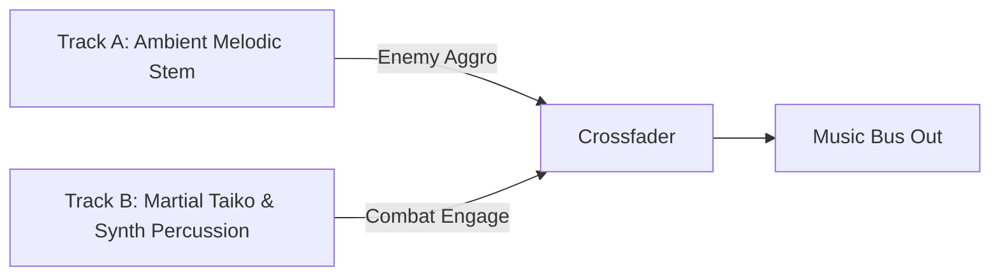

# Echoes of the Celestial Staff — Audio Direction & Sound Design

**Document Version:** 1.0.0  
**Phase:** Phase 0 (Architecture & Design)  
**Target Engine:** Godot 4.7.2 Stable  
**Acoustic Philosophy:** Tactile Martial Weight, High-Readability Cues, Dynamic East Asian Orchestration  

---

## 1. Acoustic Philosophy

In *Echoes of the Celestial Staff*, audio is not passive decoration; it is a primary gameplay interface. Players should be capable of parrying, dodging perilous attacks, and recognizing combo cadences using sound alone.

### 1.1 Core Sound Pillars
1. **Tactile Weight:** Attacks feel physically grounded. Impacts differentiate clearly between cloth, flesh, armor, stone, and bone.
2. **Frequency Separation:** Low bass rumbles give power to heavy strikes, crisp midrange accents martial movement, and piercing high frequencies communicate critical parry/dodge telegraphs.
3. **Auditory Cleanliness:** No muddy frequency buildup. Audio bus ducking and prioritized voice-limiting ensure key gameplay cues cut through during intense skirmishes.

---

## 2. Musical Direction & Dynamic Composition

### 2.1 Instrumentation Palette
- **Traditional Asian Instruments:** Guzheng (zither), Erhu (two-stringed violin), Dizi (bamboo flute), Pipa (lute), Sheng (mouth reed), Taiko & Bangu (martial percussion), Bronze Gongs & Temple Bells.
- **Modern Cinematic Elements:** Deep sub-bass drones (30–60Hz), analog modular synthesizers, granular atmospheric pads, and orchestral strings.

### 2.2 Interactive Music Architecture
Music is implemented as multi-track stems synchronized to an identical BPM and measure grid:



1. **Ambient State:** Only Track A (Guzheng, Dizi, nature ambience) plays at volume `0 dB`. Track B is muted (`-80 dB`).
2. **Combat Engagement:** Upon registering enemy combat state, `AudioManager` smoothly fades in Track B (Taiko drums, driving bass) over 0.4 seconds without desynchronizing the measure.
3. **Combat Resolution:** When the last hostile enemy falls, Track B gently fades out over 1.5 seconds, returning to tranquil ambience.
4. **Boss Phases:** Each boss encounter features dedicated multi-movement compositions where phase transitions trigger dynamic structural shifts in the musical arrangement.

---

## 3. Sound Effects (SFX) Taxonomy

### 3.1 Staff Weapon Sound Suite

| Material / Stance | Impact Character | Whoosh / Swing Character |
| :--- | :--- | :--- |
| **Broken Staff** | Raw, splintered oak thud; dull clatter. | Low-velocity wooden whistle. |
| **Spirit Staff (Swift)** | Crisp polished ironwood, subtle resonant hum. | Sharp, airy whip whoosh (`#55E6C1`). |
| **Flame Staff (Mountain)** | Heavy granite crushing impact, low explosive boom. | Deep roaring flame rush (`#F39C12`). |
| **Thunder Staff (Storm)** | Snapping electrical discharge, metallic crackle. | Ionized hum with crackling sparks (`#9B59B6`). |
| **Celestial Staff (Awakened)**| Cosmic crystalline strike, spatial ringing gong. | Low sub-bass warp and shimmering celestial chimes. |

### 3.2 Defensive & Telegraph Audio Signifiers
- **Standard Dodge:** Crisp fabric flutter and directional footstep scuff.
- **Perfect Dodge:** Rapid high-pass suction ("whooom") followed by an ethereal glass-harmonicon chime.
- **Standard Guard:** Heavy blunt collision of wood against metal; low thud.
- **Perfect Parry:** Explosive, razor-sharp metallic deflection chime (`1.8 kHz - 3.2 kHz`) accompanied by a 40Hz sub-bass thump.
- **Perilous (Unblockable) Telegraph:** Ominous, low Tibetan-style bronze horn swell (`80Hz - 160Hz`), immediately alerting the player to evade rather than block.

---

## 4. Godot Audio Bus Architecture

Godot's Audio Bus layout (`default_bus_layout.tres`) is structured into dedicated, decoupled buses:

```
Master (Bus 0)
├── Music (Bus 1) -> LowPassFilter (disabled by default, engages on pause/hitstop)
├── Ambience (Bus 2) -> Reverb
├── SFX (Bus 3)
│   ├── PlayerSFX (Bus 4) -> High Priority
│   ├── WeaponSFX (Bus 5) -> High Priority
│   ├── EnemySFX (Bus 6) -> Medium Priority
│   └── WorldSFX (Bus 7) -> Low Priority
├── Voice (Bus 8) -> Grunts, Exertions, Breaths
└── UI (Bus 9) -> Zero-Latency Clicks, Menus
```

### 4.1 Real-Time Audio DSP Processing
- **Hitstop Damping:** During combat hitstop frames (e.g. 6–12 frames), `AudioManager` activates a **24dB Low-Pass Filter** (cutoff `450 Hz`) on `Music` and `Ambience` buses, creating a dramatic sensory vacuum that accentuates the impact.
- **Audio Ducking:** When a `Perfect Parry` or `Execution Strike` occurs, the `SFX` bus ducks `Music` by `-6 dB` for 0.6 seconds.

---

## 5. Technical Audio Implementation Rules

1. **Format Standards:**
   - **SFX & Impacts:** 16-bit, 44.1 kHz `.wav` for zero-latency instant playback.
   - **Music & Ambient Loops:** Stereo Ogg Vorbis (`.ogg`) at 160 kbps for low memory footprint and seamless looping.
2. **Audio Stream Pooling:**
   - High-frequency SFX (footsteps, staff impacts, spark chimes) utilize an internal pool of 16 pre-allocated `AudioStreamPlayer2D` instances to eliminate runtime garbage collection stutter.
3. **Randomized Pitch Variations:**
   - All repetitive actions (swings, footsteps, basic impacts) apply slight pitch randomization (`pitch_scale = randf_range(0.95, 1.05)`) to eliminate auditory fatigue.
