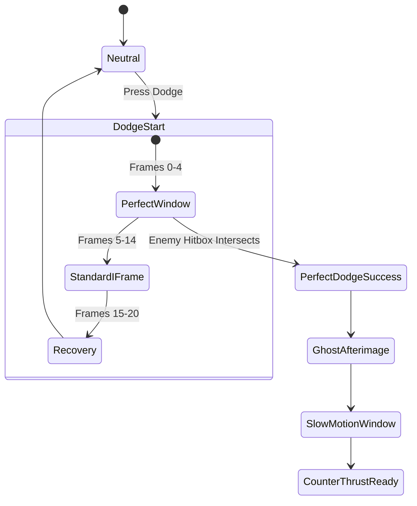
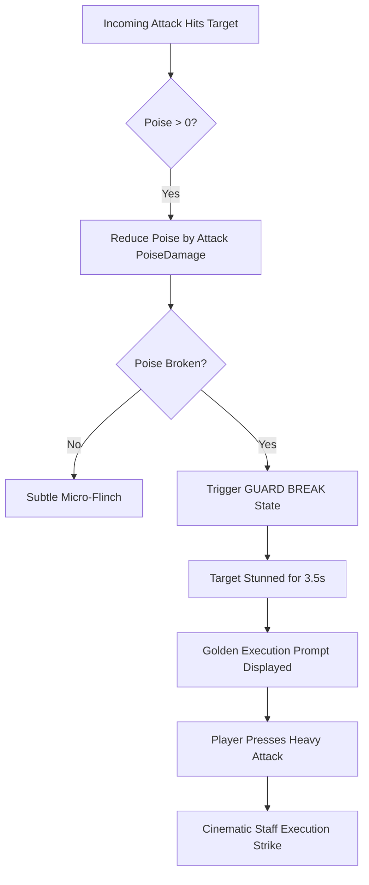

# Echoes of the Celestial Staff — Combat Design Specification

**Document Version:** 1.1.0  
**Phase Status:** Phase 3 — Combat Foundation (Implemented)  
**Target Engine:** Godot 4.7.2 Stable  
**Combat Philosophy:** High Responsiveness, Uncompromising Readability, Tactical Stance Switching  

---

> [!NOTE]
> **Phase 3 Implementation Status:**
> - **COMPLETE:** Data-driven attacks (`AttackData`), 3-hit light combo (`L -> L -> L`), Heavy Attack foundation (`heavy_1`), Hitbox (`Area2D`, Layer 4), Hurtbox (`Area2D`, Layer 6/7), Damage payload (`DamageInfo`), HealthComponent, PoiseComponent / Stagger, Knockback, Hitstop (`GameManager.apply_hitstop`), Attack input buffering (350ms), Facing integration (+1 / -1 positioning), Combat test dummy, Combat test room.
> - **FUTURE PHASES:** Charged strike, aerial combat, stances (Swift, Mountain, Storm), dodge / perfect dodge, parry / riposte, spirit arts, transformation, execution cinematics, full enemy AI.

---

## 1. Combat Design Pillars

```
+-------------------------------------------------------------+
|                     COMBAT PILLARS                          |
+-------------------------------------------------------------+
| 1. RESPONSIVENESS : Instant input registration, zero lag.   |
| 2. READABILITY    : Unmistakable telegraphs & distinct SFX. |
| 3. TIMING         : High reward for precision parry & dodge.|
| 4. PLAYER CONTROL : Fluid animation cancellation windows.   |
| 5. HIT FEEDBACK   : Punchy hitstop, trauma, & spark vectors.|
+-------------------------------------------------------------+
```

---

## 2. Attack Architecture & Combos

### 2.1 Attack Taxonomy

| Attack Type | Input Command | Frame Windup | Active Frames | Recovery | Primary Purpose |
| :--- | :--- | :--- | :--- | :--- | :--- |
| **Light Attack 1** | `attack_light` | 4 frames (66ms) | 3 frames | 8 frames | Fast opener, poke, combo starter. |
| **Light Attack 2** | `attack_light` | 5 frames | 3 frames | 8 frames | Follow-up horizontal sweep. |
| **Light Attack 3** | `attack_light` | 6 frames | 4 frames | 12 frames | Multi-thrust flurry or step-in strike. |
| **Heavy Finisher** | `attack_heavy` | 14 frames | 5 frames | 18 frames | Massive poise damage, knockback. |
| **Charged Strike** | Hold `attack_heavy` | 20-45 frames | 6 frames | 22 frames | Armor-breaking shockwave, tier 1-3 charge. |
| **Aerial Light** | Air + `attack_light`| 4 frames | 4 frames | 6 frames | Anti-air or mid-air suspension strike. |
| **Aerial Plunge** | Air + Down + `heavy`| 8 frames | Active till ground | 12 frames | Downward drill strike; AoE shockwave on impact. |

### 2.2 Combo Branching Table
Combos branch fluidly based on sequence and stance:
- **`L -> L -> L`**: Rapid clearing sequence. Minimal recovery, safe on block.
- **`L -> H`**: Quick Knockdown. Truncates combo directly into heavy sweeping knockback.
- **`L -> L -> H`**: Launch Strike. Launches standard enemies into the air for aerial juggling.
- **`Dash + L`**: Running slide thrust. Rapid gap closer.
- **`Jump -> Air L -> Air Plunge`**: Aerial slam combo.

### 2.3 Animation Cancellation Rules
- **Windup Phase:** Cannot be canceled (prevents infinite feint exploit).
- **Active Phase:** Cannot be canceled; hitbox must resolve.
- **Recovery Phase:** **Cancels immediately** upon registering a `dodge` or `parry` input. This guarantees the combat feels agile rather than clunky.

---

## 3. Defense & Evasion Systems

### 3.1 Dodge & The Perfect Dodge



1. **Standard Dodge:**
   - Total Duration: 20 frames (333ms).
   - Invulnerability Frames (I-Frames): Frames 2 through 14 (200ms).
   - Stamina Cost: 15 stamina.
2. **Perfect Dodge:**
   - Window: Intersecting an attack during frames 0 through 4 of the dodge.
   - **Feedback & Rewards:**
     - Leaves a celestial spirit clone/afterimage at the origin point.
     - Triggers **6 frames of world hitstop** (player moves at normal speed).
     - Instantly refunds 100% of dodge stamina cost.
     - Generates +20 Spirit Energy.
     - Grants immediate access to **Shadow Counter** (instant thrust behind the enemy).

### 3.2 Block, Parry & Stagger Deflection
1. **Guard:** Holding `block` reduces incoming physical damage by 70%, but drains stamina per hit.
2. **Perfect Parry:**
   - Window: Tapping `block` within **5 frames (83ms)** of incoming attack collision.
   - **Result:**
     - Zero damage taken; zero stamina consumed.
     - Emits a golden shockwave flash and metallic resonance SFX.
     - Inflicts heavy **Poise Damage** on the attacker.
     - Triggers 8 frames of hitstop and slight screen trauma.
     - Opens up the attacker to an immediate **Riposte / Counter-Attack**.

---

## 4. Poise, Stagger & Guard Break

Every entity (Player, Enemies, Bosses) maintains a secondary defense bar: **Poise (Posture)**.



- **Guard Break State:** The target drops guard, is outlined in celestial gold, and takes 1.5x damage for 3.5 seconds.
- **Execution Strike:** Triggering `attack_heavy` adjacent to a guard-broken enemy locks both characters into a 24-frame cinematic strike dealing massive damage and restoring a portion of Yuan's vitality.

---

## 5. The Three Martial Stances

Yuan can switch stances seamlessly during neutral or combo recovery by pressing stance hotkeys (`stance_swift`, `stance_mountain`, `stance_storm`).

```
           [SWIFT STANCE]
           /            \
          /              \
         v                v
[MOUNTAIN STANCE] <---> [STORM STANCE]
```

### 5.1 Swift Stance (Style of the Falcon)
- **Concept:** Agile, airborne, lightning-fast flurries.
- **Weapon Form:** Lightweight, extended reach spirit staff with tapered ends.
- **Passives:** +20% movement speed, +30% jump height, -25% dodge stamina cost.
- **Signature Move — *Celestial Vault*:** Vaults over the enemy using the staff as a fulcrum, landing behind them while striking the spine.
- **Ideal Against:** Fast, nimble enemies and aerial flying targets.

### 5.2 Mountain Stance (Style of the Granite Sentinel)
- **Concept:** Unmovable foundation, devastating overhead strikes, armor-crushing impacts.
- **Weapon Form:** Dense, heavy stone-and-flame-encrusted staff.
- **Passives:** Hyper-armor on heavy attacks (cannot be interrupted by standard attacks), +60% poise damage.
- **Signature Move — *Earth Splitter*:** Yuan charges energy and leaps into a monumental downward hammer smash, splitting the ground and emitting a shockwave.
- **Ideal Against:** Shielded enemies, heavy armored brutes, and bosses in defensive phases.

### 5.3 Storm Stance (Style of the Roaring Dragon)
- **Concept:** Relentless martial rhythm, spinning sweeps, spiraling elemental vortices.
- **Weapon Form:** Twin-tipped crackling lightning staff.
- **Passives:** Attacks hit multiple times per swing; double Spirit generation rate.
- **Signature Move — *Tempest Twirl*:** Yuan spins the staff in a continuous 360-degree shield of rotating strikes, deflecting weak projectiles and shredding surrounding crowds.
- **Ideal Against:** Swarms of multiple enemies and punishing extended boss vulnerability windows.

---

## 6. Spirit Arts & Divine Transformation

### 6.1 Spirit Arts (Active Skills)
Consumes chunks of the 100-point Spirit Meter:
1. **Spirit Wave (Cost: 25 Spirit):** A horizontal sweeping arc of pure celestial qi slicing through multiple targets at mid-range.
2. **Astral Mirror (Cost: 35 Spirit):** Summons a stationary celestial mirror decoy that explodes when struck by an enemy, freezing them in time for 2 seconds.
3. **Ascending Dragon (Cost: 50 Spirit):** A spiraling vertical staff drill that launches Yuan and all nearby foes into the air.

### 6.2 Celestial Awakening (Transformation)
- **Trigger:** When both Spirit and Awakening meters are maxed, press `L2 + R2` (or `Q + E`).
- **Duration:** 15 seconds of divine ascension.
- **State Properties:**
  - Yuan manifests a radiant celestial aura and ethereal golden staff.
  - Infinite stamina during transformation.
  - Attacks gain extended cosmic reach and spatial slashes.
  - Immune to stagger and flinching.
  - Can be ended early by executing **Heaven's Mandate** (a full-screen celestial staff plunge).

---

## 7. Game Feel ("Juice") Parameters

To achieve a AAA-level satisfying feel, combat calculations directly feed the feel pipeline:

```gdscript
# Canonical Hitstop & Trauma Lookup Table
const COMBAT_JUICE_TABLE = {
    "light_hit":       {"hitstop_frames": 3,  "trauma": 0.08, "audio_duck_db": -2.0},
    "heavy_hit":       {"hitstop_frames": 7,  "trauma": 0.22, "audio_duck_db": -6.0},
    "perfect_dodge":   {"hitstop_frames": 6,  "trauma": 0.12, "audio_duck_db": -4.0},
    "perfect_parry":   {"hitstop_frames": 9,  "trauma": 0.35, "audio_duck_db": -10.0},
    "guard_break":     {"hitstop_frames": 12, "trauma": 0.45, "audio_duck_db": -12.0},
    "execution_kill":  {"hitstop_frames": 16, "trauma": 0.60, "audio_duck_db": -16.0}
}
```

1. **Hitstop Implementation:** `Engine.time_scale` is dialed to `0.0` for the designated frames, then restored cleanly without jitter.
2. **Camera Trauma:** Camera shake uses a non-linear trauma formula: $Shake = Trauma^2 \times MaxOffset$, ensuring subtle hits feel gentle while heavy hits deliver visceral impact.
3. **Impact Sparks:** 2D spark particles eject in a 30-degree cone perpendicular to the strike angle.
