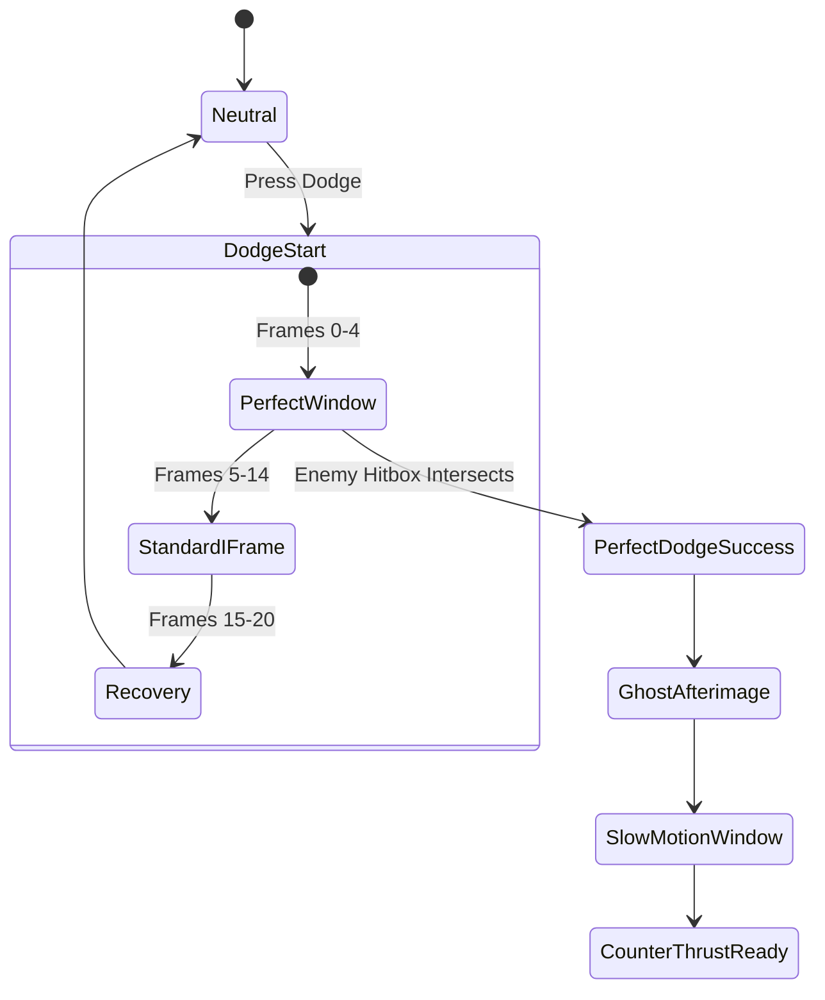
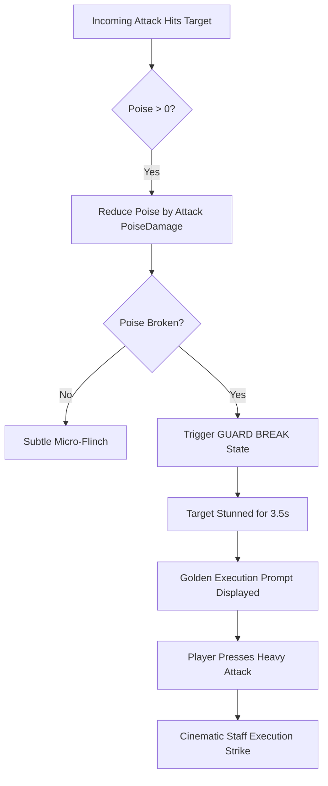

# Echoes of the Celestial Staff — Combat Design Specification

**Document Version:** 1.7.0  
**Phase Status:** Phase 9 — Boss Framework (Implemented)  
**Target Engine:** Godot 4.7.2 Stable  
**Combat Philosophy:** High Responsiveness, Uncompromising Readability, Tactical Stance Switching  

---

> [!NOTE]
> **Implementation Status:**
> - **PHASE 3 COMPLETE:** Data-driven attacks (`AttackData`), 3-hit light combo (`L -> L -> L`), Heavy Attack foundation (`heavy_1`), Hitbox (`Area2D`, Layer 4), Hurtbox (`Area2D`, Layer 6/7), Damage payload (`DamageInfo`), HealthComponent, PoiseComponent / Stagger, Knockback, Hitstop (`GameManager.apply_hitstop`), Attack input buffering (350ms), Facing integration (+1 / -1 positioning), Combat test dummy, Combat test room.
> - **PHASE 4 COMPLETE:** Defensive components (`DefenseController`), ground dodge with active I-frames (`0.033s - 0.200s`), perfect dodge window (`0.033s - 0.100s`), ground parry with deflection window (`0.033s - 0.253s`), perfect parry with poise interruption (`25.0` poise damage), aerial light attack (`attack_air_1.tres`), charged heavy strike (`attack_heavy_1.tres`, 1.0x to 2.0x scaling), recovery cancellation framework (`can_cancel_attack()`), `CombatTrainingAttacker` enemy prototype, `test_defense_room.tscn`.
> - **PHASE 5 COMPLETE:** Three Combat Stances (`SWIFT`, `MOUNTAIN`, `STORM`), `StanceData` resources, `StanceController` component, dynamic runtime multiplier pipeline (movement speed, acceleration, attack speed, damage, poise damage, dodge velocity, dodge recovery), strict parry window preservation (`1.00x`), state machine gatekeeping rules (safe switching during recovery/locomotion; blocked during startup/active/I-frames/heavy charge), zero base resource mutation, visual color flash & procedural squash/stretch feedback, `test_stance_room.tscn`.
> - **PHASE 6 COMPLETE:** Data-driven Spirit Ability framework (`SpiritAbilityData`), `SpiritComponent` (100 max, transactional consumption, combat replenishment hooks: Light +4, Heavy +8, Parry +10), `SpiritAbilityController` (3 slots, cooldown timers, phase lifecycle), `PlayerSpiritAbilityState` (cancellable into dodge/parry during recovery), 3 prototype abilities (`Celestial Arc` projectile, `Heavenly Pulse` 64px AoE, `Cloud Step` 550 px/s mobility burst), `SpiritHUD`, `test_spirit_room.tscn`.
> - **PHASE 7 COMPLETE:** Temporary supernatural transformation state (`TransformationController`, `TransformationData`), Celestial Awakening (`transformation_celestial_awakening.tres`), deterministic countdown duration (12.0s), 100 Spirit activation cost, complete multiplier pipeline (1.15x speed/accel/decel, 1.20x attack speed, 1.30x damage, 1.35x poise, 1.25x ability damage, 1.15x dodge velocity, 0.85x dodge recovery, 1.20x hitstop), defense timing invariance (I-frames and parry windows strictly 1.0x), atomic spirit consumption, state machine gatekeeping rules (allowed during locomotion and attack recovery; blocked during startup/active/I-frames/parry/charge/ability), idempotent deactivation and total state reversibility, visual gold/celestial aura tweens, extended Awakening HUD bar and live debug telemetry, interactive gym `scenes/world/test_transformation_room.tscn`, 113 automated unit tests.
> - **PHASE 8 COMPLETE:** Reusable Enemy AI architecture (`EnemyController`, `EnemyData`, `EnemyAttackData`), complete 8-state machine (`Idle`, `Patrol`, `Alert`, `Chase`, `Combat`, `Hit`, `Stagger`, `Dead`), throttled perception system (~12.5 Hz, detection and loss ranges, line-of-sight raycasting), direct 2D steering locomotion with patrol bounds, attack lifecycle (`READY` -> `TELEGRAPH` -> `ACTIVE` -> `RECOVERY` -> `COOLDOWN`), existing Hitbox/Hurtbox/DamageInfo reuse, player Perfect Parry interruption hook (`interrupt_attack()`), Health and Poise integration with Stagger state lockout, idempotent death sequence, Celestial Guard prototype, `test_enemy_ai_room.tscn`, 133 automated unit tests.
> - **PHASE 9 COMPLETE:** Reusable Boss Framework (`BossController`, `BossData`, `BossPhaseData`, `BossAttackData`), The Granite Abbot prototype, 2-phase combat system (Phase 1: "Stone Discipline", Phase 2: "Awakened Granite" at <= 50% HP), 8-state boss StateMachine, deterministic idempotent phase transitions, procedural readable telegraph system (`BossTelegraphController`), weighted pseudo-random attack selection, defense integration (Perfect Parry deflects boss attacks via `interrupt_attack()`, forces flinch recoil, and deals poise damage), physical arena locking and unlock upon victory (`BossArenaController`), `BossHealthBar` HUD, `test_granite_abbot_room.tscn`, 124 automated unit tests (797 total tests passing).
> - **FUTURE PHASES:** Metroidvania progression, world gameplay.

---

## 1. Combat Design Pillars

```
+-------------------------------------------------------------+
|                     COMBAT PILLARS                          |
+-------------------------------------------------------------+
| 1. RESPONSIVENESS : Instant input registration, zero lag.   |
| 2. READABILITY    : Unmistakable telegraphs & distinct SFX. |
| 3. TIMING         : High reward for precision parry & dodge.|
| 4. PLAYER CONTROL : Fluid animation cancellation windows.   |
| 5. HIT FEEDBACK   : Punchy hitstop, trauma, & spark vectors.|
+-------------------------------------------------------------+
```

---

## 2. Attack Architecture & Combos

### 2.1 Attack Taxonomy

| Attack Type | Input Command | Frame Windup | Active Frames | Recovery | Primary Purpose |
| :--- | :--- | :--- | :--- | :--- | :--- |
| **Light Attack 1** | `attack_light` | 4 frames (66ms) | 3 frames | 8 frames | Fast opener, poke, combo starter. |
| **Light Attack 2** | `attack_light` | 5 frames | 3 frames | 8 frames | Follow-up horizontal sweep. |
| **Light Attack 3** | `attack_light` | 6 frames | 4 frames | 12 frames | Multi-thrust flurry or step-in strike. |
| **Heavy Finisher** | `attack_heavy` | 14 frames | 5 frames | 18 frames | Massive poise damage, knockback. |
| **Charged Strike** | Hold `attack_heavy` | 20-45 frames | 6 frames | 22 frames | Armor-breaking shockwave, tier 1-3 charge. |
| **Aerial Light** | Air + `attack_light`| 4 frames | 4 frames | 6 frames | Anti-air or mid-air suspension strike. |
| **Aerial Plunge** | Air + Down + `heavy`| 8 frames | Active till ground | 12 frames | Downward drill strike; AoE shockwave on impact. |

### 2.2 Combo Branching Table
Combos branch fluidly based on sequence and stance:
- **`L -> L -> L`**: Rapid clearing sequence. Minimal recovery, safe on block.
- **`L -> H`**: Quick Knockdown. Truncates combo directly into heavy sweeping knockback.
- **`L -> L -> H`**: Launch Strike. Launches standard enemies into the air for aerial juggling.
- **`Dash + L`**: Running slide thrust. Rapid gap closer.
- **`Jump -> Air L -> Air Plunge`**: Aerial slam combo.

### 2.3 Animation Cancellation Rules
- **Windup Phase:** Cannot be canceled (prevents infinite feint exploit).
- **Active Phase:** Cannot be canceled; hitbox must resolve.
- **Recovery Phase:** **Cancels immediately** upon registering a `dodge` or `parry` input. This guarantees the combat feels agile rather than clunky.

---

## 3. Defense & Evasion Systems

### 3.1 Dodge & The Perfect Dodge



1. **Standard Dodge:**
   - Total Duration: 20 frames (333ms).
   - Invulnerability Frames (I-Frames): Frames 2 through 14 (200ms).
   - Stamina Cost: 15 stamina.
2. **Perfect Dodge:**
   - Window: Intersecting an attack during frames 0 through 4 of the dodge.
   - **Feedback & Rewards:**
     - Leaves a celestial spirit clone/afterimage at the origin point.
     - Triggers **6 frames of world hitstop** (player moves at normal speed).
     - Instantly refunds 100% of dodge stamina cost.
     - Generates +20 Spirit Energy.
     - Grants immediate access to **Shadow Counter** (instant thrust behind the enemy).

### 3.2 Block, Parry & Stagger Deflection
1. **Guard:** Holding `block` reduces incoming physical damage by 70%, but drains stamina per hit.
2. **Perfect Parry:**
   - Window: Tapping `block` within **5 frames (83ms)** of incoming attack collision.
   - **Result:**
     - Zero damage taken; zero stamina consumed.
     - Emits a golden shockwave flash and metallic resonance SFX.
     - Inflicts heavy **Poise Damage** on the attacker.
     - Triggers 8 frames of hitstop and slight screen trauma.
     - Opens up the attacker to an immediate **Riposte / Counter-Attack**.

---

## 4. Poise, Stagger & Guard Break

Every entity (Player, Enemies, Bosses) maintains a secondary defense bar: **Poise (Posture)**.



- **Guard Break State:** The target drops guard, is outlined in celestial gold, and takes 1.5x damage for 3.5 seconds.
- **Execution Strike:** Triggering `attack_heavy` adjacent to a guard-broken enemy locks both characters into a 24-frame cinematic strike dealing massive damage and restoring a portion of Yuan's vitality.

---

## 5. The Three Martial Stances

Yuan can switch stances seamlessly during neutral or combo recovery by pressing stance hotkeys (`stance_swift`, `stance_mountain`, `stance_storm`).

```
           [SWIFT STANCE]
           /            \
          /              \
         v                v
[MOUNTAIN STANCE] <---> [STORM STANCE]
```

### 5.1 Stance Multiplier Matrix

| Parameter | Swift Stance | Mountain Stance | Storm Stance | Design Intent & Combat Feel |
| :--- | :--- | :--- | :--- | :--- |
| **Move Speed** | `1.10x` | `0.90x` | `1.00x` | Swift enables rapid spacing; Mountain enforces deliberate footing. |
| **Acceleration** | `1.10x` | `0.90x` | `1.00x` | Swift bursts instantly into max velocity. |
| **Deceleration** | `1.05x` | `0.95x` | `1.00x` | Mountain carries more grounded inertia. |
| **Attack Speed** | `1.12x` | `0.88x` | `1.05x` | Swift compresses windup/active/recovery; Mountain strikes with heavy weight. |
| **Attack Damage** | `0.90x` | `1.18x` | `1.08x` | Swift trades burst for speed; Mountain delivers crushing individual blows. |
| **Poise Damage** | `0.90x` | `1.30x` | `1.05x` | Mountain is the premier stance for breaking heavy armor and postures. |
| **Dodge Velocity** | `1.12x` (`425.6 px/s`) | `0.90x` (`342.0 px/s`) | `1.00x` (`380.0 px/s`) | Swift covers extended ground on evasions. |
| **Dodge Recovery** | `0.90x` | `1.10x` | `1.00x` | Swift recovers fast; Mountain has slight recovery penalty. |
| **Parry Window** | `1.00x` | `1.00x` | `1.00x` | **Strictly invariant** across all stances to protect parry muscle memory. |
| **Hitstop Factor** | `0.90x` | `1.15x` | `1.00x` | Mountain impacts freeze world time longer for tactile weight. |
| **Visual Tint** | Cyan (`#4DEEEA`) | Amber/Gold (`#E67E22`) | Electric Blue (`#3498DB`)| Instant visual recognition for state tracking. |

### 5.2 Stance Switching Gatekeeping Rules
- **Allowed States:** `Idle`, `Run`, `Fall`, `Jump`, and attack `Recovery` frames. Stance switching during recovery acts as an agile stance-cancel technique.
- **Blocked States:**
  - Attack `Startup` and `Active` frames (must commit to swing).
  - Heavy charge loop (`is_charging_heavy == true`).
  - Dodge invulnerability window (prevents I-frame exploit buffering).
  - Active parry deflection window (prevents parry abuse).
  - Mid-air attack active frames.
- **State Persistence:** Player health, poise, world position, and linear momentum are strictly preserved across stance switches.

### 5.3 Implementation Architecture
- Stances are represented by custom `Resource` assets: `data/characters/stance_swift.tres`, `stance_mountain.tres`, and `stance_storm.tres`.
- Evaluated at runtime through `StanceController` (`scripts/player/stance_controller.gd`).
- Base attack resources (`data/attacks/*.tres`) remain completely unmutated.

---

## 6. Spirit Arts & Divine Transformation

### 6.1 Spirit Arts (Active Skills)
Powered by the 100-point Spirit Meter (`SpiritComponent`). Spirit does not passively regenerate, reinforcing proactive aggressive martial combat.
- **Combat Replenishment Pipeline:**
  - Light Attack Hit: `+4.0 Spirit`
  - Heavy Attack Hit: `+8.0 Spirit`
  - Perfect Parry: `+10.0 Spirit`

#### Implemented Abilities (Phase 6 Prototypes):
1. **Celestial Arc (`ability_celestial_arc.tres`):**
   - **Type:** `PROJECTILE`
   - **Cost:** 20 Spirit | **Cooldown:** 2.0s
   - **Damage:** 18.0 | **Poise Damage:** 15.0 | **Speed:** 480 px/s | **Lifetime:** 1.2s
   - **Mechanics:** Piercing crescent blade fired on Layer 4 (`PlayerHitbox`). Tracks hit hurtboxes to guarantee single-hit rule.
2. **Heavenly Pulse (`ability_heavenly_pulse.tres`):**
   - **Type:** `AREA`
   - **Cost:** 30 Spirit | **Cooldown:** 4.0s
   - **Damage:** 24.0 | **Poise Damage:** 35.0 | **Radius:** 64px
   - **Mechanics:** Ground/aerial radiating shockwave. Hits all enemies within 64px radius simultaneously, inflicting massive poise damage and knockback. Single-hit per activation.
3. **Cloud Step (`ability_cloud_step.tres`):**
   - **Type:** `MOBILITY`
   - **Cost:** 25 Spirit | **Cooldown:** 5.0s
   - **Burst Velocity:** 550 px/s | **Active Duration:** 0.20s
   - **Mechanics:** High-speed horizontal martial dash along facing vector. Does not grant unconditional I-frames or corrupt world collision geometry. Provides agile gap closing or repositioning.

#### Casting Safety & Gatekeeping Rules:
- Blocked during weapon attack `Startup` and `Active` frames.
- Blocked during active Dodge I-frames and active Parry frames.
- Allowed during locomotion (`Idle`, `Run`, `Jump`, `Fall`) and attack `Recovery` frames.
- Ability recovery frames can be cancelled into Dodge or Parry for high-level evasion.

### 6.2 Celestial Awakening (Transformation Subsystem)

The Celestial Awakening is Yuan's temporary, supernatural transformation state. Rather than spawning a duplicate character scene or branching the state machine, it is implemented as a deterministic runtime modifier layer over existing player systems.

- **Trigger Command:** `ACTION_TRANSFORMATION_ACTIVATE` (`KEY_F`, `KEY_V`).
- **Activation Cost:** 100.0 Spirit (atomically consumed from `SpiritComponent`). Cannot be activated with < 100.0 Spirit.
- **Duration:** 12.0 seconds (`duration = 12.0`) deterministic countdown timer.
- **Phase Lifecycle:** `INACTIVE` -> `ACTIVATING` -> `ACTIVE` -> `ENDING` -> `INACTIVE`.
- **Multiplier Pipeline (`TransformationData`):**
  - **Locomotion:**
    - `movement_speed_multiplier`: `1.15x` (stacks multiplicatively with stance: Swift = 1.265x, Mountain = 1.035x, Storm = 1.15x).
    - `acceleration_multiplier`: `1.15x`.
    - `deceleration_multiplier`: `1.15x`.
  - **Weapon Combat:**
    - `attack_speed_multiplier`: `1.20x` (reduces windup, active, and recovery durations by dividing elapsed thresholds by 1.20).
    - `damage_multiplier`: `1.30x` (applied to hitbox damage payload).
    - `poise_damage_multiplier`: `1.35x` (amplifies posture break and stagger pressure).
    - `hitstop_duration_multiplier`: `1.20x` (enhanced tactile impact freezes).
  - **Defense & Evasion:**
    - `dodge_velocity_multiplier`: `1.15x` (extends ground dodge distance).
    - `dodge_recovery_multiplier`: `0.85x` (recovers faster out of dodge roll).
    - **Defense Invariance:** Dodge I-frame window (`0.033s - 0.200s`), perfect dodge window (`0.033s - 0.100s`), parry deflection window (`0.033s - 0.253s`), and perfect parry window (`0.033s - 0.100s`) remain strictly `1.00x` invariant to preserve player muscle memory.
  - **Spirit Abilities:**
    - `spirit_ability_damage_multiplier`: `1.25x` (amplifies projectile impacts and radiating shockwaves).
- **Gatekeeping Rules:**
  - Blocked during weapon attack `Startup` and `Active` frames.
  - Blocked during active Dodge I-frames and active Parry deflection windows.
  - Blocked during Heavy Attack charging.
  - Blocked during Spirit Ability `Startup` and `Active` phases.
  - Blocked if already in `ACTIVATING`, `ACTIVE`, or `ENDING` state.
  - Permitted during locomotion (`Idle`, `Run`, `Jump`, `Fall`) and attack `Recovery` frames.
- **Stance Compatibility:** Fully orthogonal to Stances (`SWIFT`, `MOUNTAIN`, `STORM`). Stance switching remains operational during Awakening recovery and locomotion.
- **Safe State Reversibility:** When the 12.0s timer expires or `deactivate(immediate=true)` is called upon death/room transition, all player attributes, timers, and multipliers immediately return to baseline `1.0x` with zero resource mutation or memory leaks.

---

## 7. Game Feel ("Juice") Parameters

To achieve a AAA-level satisfying feel, combat calculations directly feed the feel pipeline:

```gdscript
# Canonical Hitstop & Trauma Lookup Table
const COMBAT_JUICE_TABLE = {
    "light_hit":       {"hitstop_frames": 3,  "trauma": 0.08, "audio_duck_db": -2.0},
    "heavy_hit":       {"hitstop_frames": 7,  "trauma": 0.22, "audio_duck_db": -6.0},
    "perfect_dodge":   {"hitstop_frames": 6,  "trauma": 0.12, "audio_duck_db": -4.0},
    "perfect_parry":   {"hitstop_frames": 9,  "trauma": 0.35, "audio_duck_db": -10.0},
    "guard_break":     {"hitstop_frames": 12, "trauma": 0.45, "audio_duck_db": -12.0},
    "execution_kill":  {"hitstop_frames": 16, "trauma": 0.60, "audio_duck_db": -16.0}
}
```

1. **Hitstop Implementation:** `Engine.time_scale` is dialed to `0.0` for the designated frames, then restored cleanly without jitter.
2. **Camera Trauma:** Camera shake uses a non-linear trauma formula: $Shake = Trauma^2 \times MaxOffset$, ensuring subtle hits feel gentle while heavy hits deliver visceral impact.
3. **Impact Sparks:** 2D spark particles eject in a 30-degree cone perpendicular to the strike angle.

---

## 8. Boss Combat Design & The Granite Abbot Prototype

### 8.1 Architectural Principles
Boss encounters in *Echoes of the Celestial Staff* are direct specializations of the core combat architecture:
- **Zero Parallel Combat Engines:** Bosses inherit and compose canonical `HealthComponent`, `PoiseComponent`, `Hitbox` (Layer 5/16), `Hurtbox` (Layer 7/64), and `DamageInfo`.
- **Defensive Sincerity:** Boss attacks are subject to player dodging (I-frames, perfect dodge) and parrying. When Yuan executes a Perfect Parry, `DefenseController` directly calls `boss.interrupt_attack()`, terminating the active swing, disabling the hitbox, and dealing heavy posture damage.
- **Telegraph Precedence:** Attack telegraph durations range from `0.35s` to `0.70s`, providing unambiguous visual and timing cues via `BossTelegraphController` for precision defense.

### 8.2 The Granite Abbot Encounter Specification
- **Identity:** Ancient stone monastic guardian wielding a massive ceremonial granite staff.
- **Phase 1: "Stone Discipline" (100% - 50% HP):**
  - Deliberate, rhythmic heavy attacks.
  - Attacks: `Granite Sweep` (20 DMG, 25 Poise, 0.50s telegraph), `Stone Overhead` (30 DMG, 35 Poise, 0.70s telegraph), `Step Strike` (16 DMG, 18 Poise, 0.35s telegraph).
- **Phase 2: "Awakened Granite" (<= 50% HP):**
  - Awakened celestial resonance: +25% move speed, +20% attack speed, +25% damage, +30% poise damage.
  - Expanded Attacks: `Awakened Sweep` (25 DMG, 30 Poise, 0.38s telegraph), `Granite Shockwave` (35 DMG, 45 Poise, 0.65s telegraph, ground impact marker, screen shake).
- **Phase Transitions:** Idempotently triggered at $\le 50\%$ HP. The boss enters `PhaseTransition` state (non-aggressive, hitboxes disabled, attacks cancelled), displays an awakened stone aura, updates multipliers, and resumes combat smoothly.
- **Arena Containment:** `BossArenaController` activates physical barriers (`StaticBody2D` on Layer 1) upon player entry trigger, binds the dedicated `BossHealthBar` HUD, and unseals the arena upon defeat.
