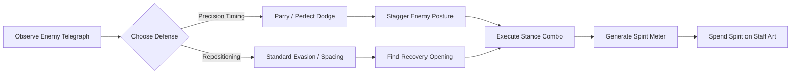

# Echoes of the Celestial Staff — Game Design Document

**Document Version:** 1.3.0  
**Phase:** Phase 9 (Boss Framework & The Granite Abbot Prototype)  
**Target Engine:** Godot 4.7.2 Stable (GL Compatibility)  
**Platform:** Windows PC  
**Genre:** High-Quality 2D Action Metroidvania  

---

## 1. Executive Summary & Game Vision

### 1.1 High Concept
*Echoes of the Celestial Staff* is an original, premium-feeling 2D action Metroidvania blending lightning-fast staff-based martial arts combat with deep, interconnected world exploration. Drawing structural inspiration from masterworks of the genre and martial philosophy from mythic literature, it delivers an uncompromising experience focused on precision, mechanical mastery, fluid movement, and evocative atmosphere.

### 1.2 The Core Premise
The Celestial Pillars that once anchored the mortal realm to the cosmic heavens have fractured. Resonance storms sweep across the world, driving wildlife feral and awakening slumbering stone sentinels. As **Yuan**, a solitary youth carrying an ancient celestial lineage, players must master the evolving facets of the Spirit Staff, traverse an intricate world of forgotten temples and treacherous mountain spires, conquer multi-phase guardians, and restore cosmic balance.

### 1.3 Design Pillars

#### Pillar 1: Combat Mastery & Uncompromising Feel
- **Speed & Precision:** Inputs must register instantly. The player is never locked into rigid, sluggish animations without deliberate tactical cause. Every frame of action is tuned for responsiveness.
- **Telegraph Readability:** Every hostile attack features clear wind-ups, distinct flash cues, and predictable strike angles. Success is earned through player skill, observation, and timing—never unfair ambush.
- **Dynamic Martial Depth:** Staff combat embraces distinct tactical stances, light/heavy chain combos, charged strikes, aerial play, precise parries, and evasive perfect dodges.
- **Sensory Impact ("Juice"):** Hits resonate through variable hitstop (micro-freezes), directional impact sparks, camera trauma, and resonant low-frequency acoustic strikes.

#### Pillar 2: Interconnected Metroidvania World
- **Atmospheric Non-Linearity:** Seven distinct biomes seamlessly woven through shortcuts, vertical shafts, secret alcoves, and elevator passages.
- **Ability-Driven Gating:** Natural environmental barriers yield not to artificial keycards, but to physical traversal and combat capabilities unlocked through staff evolution and spirit arts.
- **Rewarding Backtracking:** Returning to earlier biomes with newly awakened capabilities reveals hidden challenge chambers, celestial lore tablets, stat upgrades, and elite encounters.

#### Pillar 3: Multi-Phase Boss Encounters
- **Mechanical Teachers:** Every major guardian embodies a core combat test—mastery of parrying, posture breaking, aerial evasion, or stance shifting.
- **Multi-Phase Evolution:** Bosses dynamically alter their rhythm, arena hazards, attack cadence, and aggression as their health and posture deplete.
- **Mastery Over Attrition:** Boss health pools are measured and fair; victories stem from recognizing patterns and exploiting punish windows rather than grinding through sponge-like health bars.

#### Pillar 4: Deep, Meaningful Progression
- **Staff Evolution:** The player's weapon evolves physically and mechanically across five cosmic milestones.
- **Stance Customization:** Unlocking and mastering three distinct martial stances (Swift, Mountain, Storm) that alter movesets, defensive options, and combo branches.
- **Spirit & Transformation Arts:** Equipping passive celestial relics, active spirit abilities, and temporary divine transformations.

---

## 2. Core Gameplay Loops

### 2.1 Micro Loop (Second-to-Second: Martial Exchange)

1. **Perceive:** Identify enemy visual/audio wind-up cue.
2. **React:** Execute parry, perfect dodge, or tactical repositioning.
3. **Punish:** Exploit vulnerability window with light/heavy stance combos, depleting enemy posture.
4. **Capitalize:** Execute stagger finisher or trigger an active Spirit Ability using gathered celestial essence.

### 2.2 Meso Loop (Minute-to-Minute: Biome Traversal & Encounter)
1. **Explore Room:** Navigate intricate 2D platforming geometry using jump, dash, and staff traversal.
2. **Combat Engagement:** Engage enemy skirmishes, prioritizing dangerous ranged attackers while parrying frontline melee combatants.
3. **Resource Management:** Monitor Health, Stamina (action pacing), and Spirit (special skills / healing).
4. **Discovery & Waypointing:** Uncover secret breakable walls, acquire celestial shards, unlock one-way gates/shortcuts, and rest at Spirit Shrines.

### 2.3 Macro Loop (Hour-to-Hour: World Progression & Ascension)
1. **Venture into Uncharted Biome:** Confront unique environmental hazards and biome-specific enemy archetypes.
2. **Conquer Zone Guardian:** Overcome the multi-phase apex guardian of the territory.
3. **Awaken Staff Evolution / Mobility Art:** Acquire a transformative celestial gift (e.g., Flame Staff ignition, Double Jump, Astral Glide).
4. **Re-evaluate the Map:** Identify newly accessible paths across previously explored biomes; backtrack for high-tier relics and challenge trials.
5. **Ascend toward the Celestial Palace:** Unlock access to endgame cosmic trials.

---

## 3. The Protagonist: Yuan

### 3.1 Background & Lore
Yuan is a young wandering martial disciple born with an ethereal birthmark mirroring the Celestial Constellations. Raised in the secluded Monkey Village at the foot of Mount Kunlun, Yuan was entrusted with the shattered remnants of an ancient relic—the Broken Staff. When celestial balance ruptures, awakening ancient terrors across the continent, Yuan sets forth to reconnect the fractured leylines.

### 3.2 Visual Archetype
- **Silhouette:** Lean, athletic, agile martial artist with flowing cloth, leather arm wraps, and a dynamic crimson sash that accentuates motion and directionality.
- **Aesthetic Contrast:** Earthy martial garments juxtaposed with brilliant celestial energy veins that flare during parries, spirit arts, and stance shifts.

### 3.3 The Evolving Weapon: The Celestial Staff
The staff is Yuan’s sole weapon, but it possesses vast metamorphic depth:
1. **Broken Staff:** Fractured wooden staff with rough iron banding. Limited reach, blunt impacts, teaches basic martial foundations.
2. **Spirit Staff:** Infused with ambient celestial qi. Extended reach, glowing spirit runes, unlocks Swift Stance and basic spirit channeling.
3. **Flame Staff:** Ignited by the core fires of the Mountain Temple. High poise-breaking weight, flame trails, unlocks Mountain Stance and obstacle burning.
4. **Thunder Staff:** Charged by the tempest spires of Thunder Peaks. Lightning-fast multi-strikes, chain sparks, unlocks Storm Stance and magnetic rail traversal.
5. **Celestial Staff:** Fully restored divine relic. Boundless reach, spatial distortion trails, simultaneous multi-stance synthesis, and celestial awakening.

---

## 4. Combat Philosophy & Core Mechanics

### 4.1 Frame Priority & Input Buffering
- **Zero Input Lag:** Movement controls (run, jump, dodge) possess zero artificial acceleration latency.
- **Input Buffer Window:** 8 frames (approx. 133ms at 60 FPS) buffer for attack inputs, ensuring combo executions feel buttery smooth without requiring strict frame-perfect button mashing.
- **Cancel Windows:** Defensive actions (dodge, parry) can cancel recovery frames of light attacks immediately after the active hitbox window ends.

### 4.2 Resource Triad
| Resource | Purpose | Regeneration Mechanics |
| :--- | :--- | :--- |
| **Health (Vitality)** | Life bar. Reaching 0 returns player to last Spirit Shrine. | Restoring at Shrines, celestial healing flasks (Elixirs), or execution lifesteal relics. |
| **Stamina (Vigor)** | Fuels attacks, dodges, and sprints. Depletion induces brief fatigue. | Rapid passive regeneration (1.2s delay after action); boosted by successful parries. |
| **Spirit (Essence)** | Fuels Spirit Abilities and Transformation Meter. | Generated exclusively by landing attacks, performing perfect dodges, and parrying. |

### 4.3 Stance Triad
Combat revolves around fluidly switching between three distinct martial stances via dedicated shoulder/key triggers:

1. **Swift Stance (The Wind):**
   - *Role:* High mobility, rapid aerial dominance, evasive hit-and-run.
   - *Modifiers:* +25% attack speed, reduced dodge stamina cost, extended jump height.
   - *Signature:* Multi-hit flurry thrusts, pole-vault kicks, aerial down-drills.

2. **Mountain Stance (The Earth):**
   - *Role:* Heavy poise, authoritative guard breaks, deliberate crushing blows.
   - *Modifiers:* Hyper-armor on heavy attacks, +50% poise damage, reduced damage taken during windups.
   - *Signature:* Overhead earth-shattering slams, sweeping crowd knockdowns, stance-specific fortress parry.

3. **Storm Stance (The Tempest):**
   - *Role:* Relentless offense, combo chaining, multi-target spirit surges.
   - *Modifiers:* Hits generate 2x Spirit meter, critical hits emit lightning arcs to nearby enemies.
   - *Signature:* 360-degree staff twirls, spinning vortex strikes, thunder thrusts.

### 4.4 Celestial Awakening (Supernatural Transformation)
Yuan's pinnacle martial state, unlocked by channeling fully concentrated celestial essence:
- **Mechanics:** Consumes 100 Spirit to ascend into a 12-second heightened celestial state.
- **Modifiers:** +15% movement speed/acceleration/deceleration, +20% attack speed, +30% attack damage, +35% poise damage, +25% spirit ability damage, +15% dodge velocity, and +15% faster dodge recovery.
- **Tactical Identity:** Temporary power spike designed to turn the tide against elite guardians and dense enemy encounters without invalidating timing fundamentals (parry and dodge invulnerability windows remain strictly invariant).
- **Decoupled Architecture:** Operates as a non-destructive runtime modifier layer with full state reversibility, stacking orthogonally with martial stances.

### 4.5 Enemy AI Archetypes & The Celestial Guard
The enemy ecosystem is built on a modular state machine architecture (`Idle`, `Patrol`, `Alert`, `Chase`, `Combat`, `Hit`, `Stagger`, `Dead`) with deterministic perception (detection radius, loss radius, line-of-sight raycasting):
- **Telegraph Clarity:** All hostile attacks feature high-contrast visual windup cues (amber warning indicator) allowing deliberate parry or dodge responses.
- **Defensive Interactivity:** Enemies react realistically to player defenses—strikes can be dodged with active I-frames or cleanly interrupted with Perfect Parries, staggering the attacker.
- **Prototype Archetype — The Celestial Guard:** Sturdy frontline melee disciple automaton (80 HP, 30 Poise, 1.4s Stagger Duration, 50 px/s Patrol, 110 px/s Chase). Teaches fundamental combat pacing, posture breaking, and parry deflection.

### 4.6 Boss Encounters & The Granite Abbot
Boss encounters establish peak combat challenges that test player mastery over defensive timing, spatial awareness, and stance optimization:
- **Physical Arena Enclosure:** Entering the boss lair dynamically seals boundaries with impassable physical barriers (`BossArenaController`), focusing combat in an enclosed arena until resolution.
- **Multi-Phase Transitions:** Bosses feature deterministic phase shifts at vital thresholds (e.g. 50% HP), expanding attack repertoires, accelerating movement, and increasing damage pressure. Transitions are idempotent and non-aggressive, ensuring fairness.
- **Readable Telegraphs & Parry Interactivity:** Attacks feature procedural visual telegraphs (warning shapes, staff glows, ground shockwave rings). Perfect Parries directly interrupt swings (`interrupt_attack()`), deflecting blows and inflicting heavy poise damage.
- **Prototype Boss — The Granite Abbot:** An ancient monastic stone guardian wielding a ceremonial granite staff (300 HP, 60 Poise, 1.8s Stagger). Tests parry rhythm in Phase 1 ("Stone Discipline") and evasive spacing against accelerated staff sweeps and radiating shockwaves in Phase 2 ("Awakened Granite").

---

## 5. Progression & RPG Systems

### 5.1 Spirit Shrines (Checkpoints)
- Function as respawn points, health replenishers, and level-up sanctums.
- Resting respawns standard enemies across the biome (bosses and unique minibosses remain permanently defeated).
- Facilitates fast travel between discovered Major Shrines across biomes.

### 5.2 The Celestial Skill Tree
Players accumulate **Celestial Qi** from fallen foes to unlock nodes across four skill constellations:
- **Discipline of Agility (Swift):** Evasion distances, air combo extensions, running slide-strikes.
- **Discipline of Fortitude (Mountain):** Poise thresholds, charge attack speed, counter-attack blast radius.
- **Discipline of Wrath (Storm):** Spirit generation rates, chain-lightning damage, combo finishers.
- **Discipline of the Spirit (Inner Harmony):** Max health/stamina/spirit nodes, elixir capacity, transformation duration.

---

## 6. Scope Boundaries & Anti-Bloat Guidelines

To maintain elite polish on the target hardware (Intel Core i3, integrated graphics):
- **Depth over Breadth:** Perfect 10 core enemy archetypes with deep AI movesets rather than 50 shallow enemies.
- **Polish over Feature Quantity:** No shoehorned mini-games, crafting mini-loops, or bloated inventory management.
- **Direct Gameplay:** Every system must directly serve either the kinetic thrill of staff martial arts or the wonder of Metroidvania discovery.
