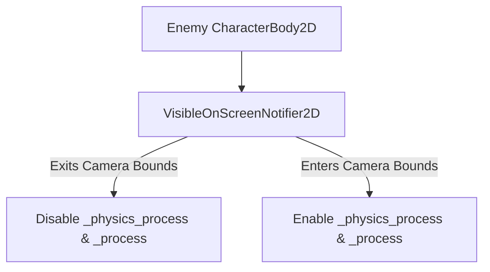

# Echoes of the Celestial Staff — Performance Targets & Optimization Architecture

**Document Version:** 1.0.0  
**Phase:** Phase 0 (Architecture & Design)  
**Target Engine:** Godot 4.7.2 Stable  
**Renderer:** GL Compatibility (`gl_compatibility`)  
**Primary Target:** Rock-Solid 60 FPS on Low-End Baseline Hardware  

---

## 1. Hardware Baseline Specification

Development and optimization are strictly anchored to the following physical development system:

| Hardware Component | Specification | Constraints & Implications |
| :--- | :--- | :--- |
| **CPU** | Intel Core i3-1115G4 (2 Cores, 4 Threads) | Strict budget on GDScript CPU cycles; minimal allocations in `_physics_process`. |
| **RAM** | 12 GB DDR4 | Keep game runtime footprint below 1.5 GB to allow editor & system headroom. |
| **GPU** | Intel UHD Graphics (48 Execution Units, Integrated) | Shared system bandwidth; avoid high fill-rate shaders, multi-pass blur, and massive textures. |
| **Storage** | NVMe M.2 Solid State Drive | Fast disk reads facilitate smooth room streaming and asset loading. |
| **Operating System**| Windows 10/11 64-bit | Primary native desktop build target. |

---

## 2. Frame Time & Processing Budgets

At **60 frames per second**, each frame has a total window of **16.66 milliseconds**:

```
+--------------------------------------------------------------------------+
| TOTAL FRAME TIME BUDGET: 16.66 ms                                        |
+--------------------------------------------------------------------------+
| [Physics: <3.0ms] | [Scripts/Logic: <4.0ms] | [Render: <8.0ms] | [Margin]|
+--------------------------------------------------------------------------+
```

1. **Physics Engine (`_physics_process`):** `< 3.0 ms`
   - Fixed at 60 ticks per second (`physics_ticks_per_second = 60`).
   - Limit active collision checks; separate static terrain from dynamic actor hurtboxes.
2. **Scripts & Gameplay Logic:** `< 4.0 ms`
   - Typed GDScript execution, state machine transitions, input buffering, and AI path evaluations.
3. **2D Rendering & Draw Calls:** `< 8.0 ms`
   - Sprite blitting, CanvasItem batching, light computation, and UI rendering.
4. **Safety Headroom:** `> 1.66 ms`
   - Protects against background OS spikes and guarantees zero dropped frames.

---

## 3. Quantitative Resource Budgets

| Metric | Target Limit | Hard Ceiling | Optimization Strategy |
| :--- | :--- | :--- | :--- |
| **Draw Calls** | `< 75` calls/frame | `100` calls/frame | Sprite sheet atlasing, unified Z-indices. |
| **VRAM Usage** | `< 350 MB` | `512 MB` | Textures capped at 2048x2048; VRAM compression. |
| **System RAM** | `< 1.0 GB` | `1.5 GB` | Unload inactive rooms; release unused resources. |
| **Active 2D Particles** | `< 150` total | `200` total | Short particle lifespans; CPUParticles2D pooling. |
| **Active Physics Bodies** | `< 25` per screen | `40` per room | Cull off-screen enemies via `VisibleOnScreenNotifier2D`. |
| **Garbage Collection Spikes** | `0` allocations in tick | `0` allocations | Preallocate arrays; zero `new()` in `_process`. |

---

## 4. Specific Engine & Renderer Optimization Rules

### 4.1 2D CanvasItem Batching in GL Compatibility
Godot's GL Compatibility renderer batches adjacent 2D draw commands if they share identical state:
1. **Texture Sharing:** All sprites for a given biome (tiles, props) must reside on the same texture atlas.
2. **Z-Index Discipline:** Avoid interleaving disparate textures across alternating Z-indices. Group foreground, characters, and backgrounds into dedicated Z-index tiers.
3. **Blend Modes:** Standard `Mix` blending only. Avoid exotic blending modes (`Add`, `Sub`) on standard sprites as they break rendering batches.

### 4.2 Entity Culling & Sleeping

- Enemies outside the active camera view suspend all AI evaluations, state timers, and raycast checks.
- Static geometry uses simple rectangular or convex collision polygons rather than dense concave meshes.

### 4.3 Node & Object Pooling (`NodePool`)
- Spawning nodes dynamically (`instance()`) causes memory fragmentation and frame hitches.
- The following entities must use pre-allocated object pools:
  1. Weapon impact sparks and slice VFX.
  2. Enemy and player projectiles.
  3. Floating combat damage numbers.
  4. Audio stream players for hit effects.

### 4.4 Zero Allocation in Process Loops
- Never create new `Array`, `Dictionary`, or `Vector` instances inside `_process(delta)` or `_physics_process(delta)`.
- Use class-level pre-allocated variables and mutate by reference.
- Cache node references in `@onready` variables rather than repeatedly calling `get_node()` or `$` during ticks.

---

## 5. Performance Monitoring & CI Verification

1. **Godot Profiler Benchmarks:** Every feature addition must profile under the Godot Profiler to ensure script execution time does not exceed the 4.0ms threshold.
2. **Stress Test Harness (`res://tests/perf_stress_test.tscn`):** A headless automated test scene that spawns 30 active combatants executing combos simultaneously while measuring physics tick duration and frame time.
