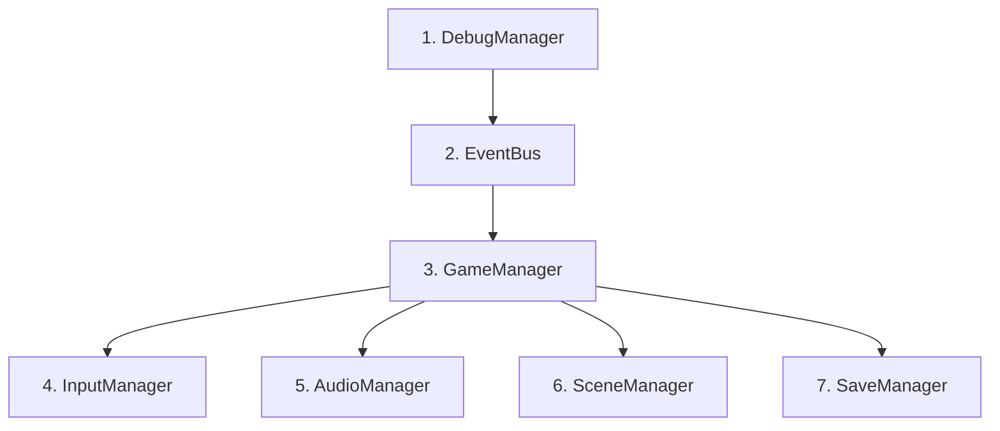
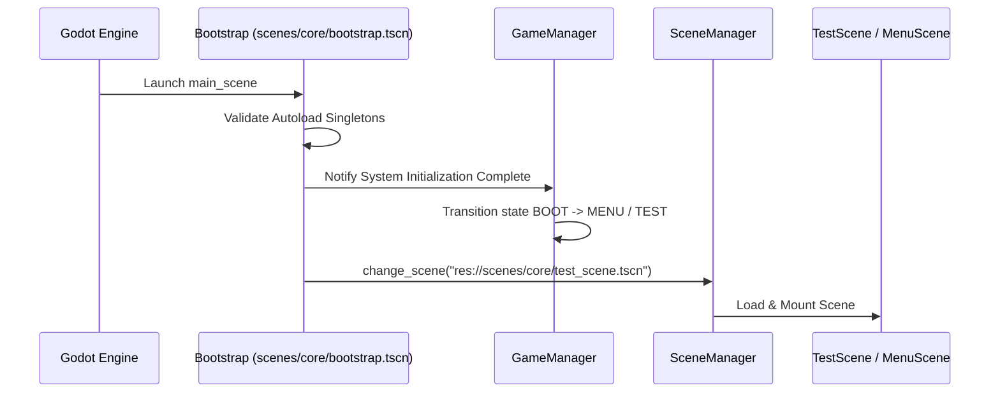

# Phase 1 Implementation Plan — Godot Foundation

**Project:** Echoes of the Celestial Staff  
**Engine:** Godot 4.7.2 Stable (GL Compatibility)  
**Phase:** Phase 1 (Godot Foundation)  
**Status:** Planning / Pending Approval  

---

## 1. Objective & Scope

Establish the reusable core technical infrastructure of the project without introducing any gameplay code (no player movement, combat, enemies, or level design).

### Systems To Build
1. `DebugManager` (`res://scripts/core/debug_manager.gd`)
2. `EventBus` (`res://scripts/core/event_bus.gd`)
3. `GameManager` (`res://scripts/core/game_manager.gd`)
4. `InputManager` (`res://scripts/core/input_manager.gd`)
5. `AudioManager` (`res://scripts/core/audio_manager.gd`)
6. `SceneManager` (`res://scripts/core/scene_manager.gd`)
7. `SaveManager` (`res://scripts/core/save_manager.gd`)
8. Audio Bus Layout (`res://default_bus_layout.tres`)
9. Bootstrap Scene & Controller (`res://scenes/core/bootstrap.tscn`, `res://scripts/core/bootstrap.gd`)
10. Test Scene (`res://scenes/core/test_scene.tscn`, `res://scripts/core/test_scene.gd`)
11. Automated Foundation Test Runner (`res://tests/test_foundation.gd`, `res://tests/test_runner.tscn`)

---

## 2. Why Each System Exists & System Responsibilities

### 2.1 `DebugManager`
- **Why it exists:** Centralizes development-only logging and diagnostics without littering standard `print()` statements across the codebase.
- **Responsibilities:**
  - Provides categorized logging: `log_info()`, `log_warn()`, `log_error()`, `log_debug()`.
  - Conditional compile/export toggle (`is_debug_enabled`) to eliminate console overhead in release builds.
  - Exposes runtime performance telemetry (`get_fps()`, `get_memory_usage()`, `get_draw_calls()`).

### 2.2 `EventBus`
- **Why it exists:** Provides decoupled, zero-dependency horizontal communication between unrelated game domains (UI, Audio, Combat, World state).
- **Responsibilities:**
  - Declares all global signals across player, enemy, boss, combat, world, and game lifecycle domains.
  - Implements the "Calls Down, Signals Up" architecture defined in `docs/DEVELOPMENT_RULES.md`.

### 2.3 `GameManager`
- **Why it exists:** Maintains high-level game state, timescale coordination, and lifecycle transitions without containing gameplay logic.
- **Responsibilities:**
  - Enum `GameState`: `BOOT`, `MENU`, `PLAYING`, `PAUSED`, `CUTSCENE`, `LOADING`, `GAME_OVER`.
  - State change validation and dispatch via `EventBus.game_state_changed`.
  - Pausing coordination (`toggle_pause()`, `set_paused()`).
  - Timescale coordination for hitstop and cutscene slow-motion (`set_time_scale()`).

### 2.4 `InputManager`
- **Why it exists:** Decouples input device mapping, action querying, and future input buffering from actor controllers.
- **Responsibilities:**
  - Standardizes all 15 gameplay input actions (`move_left`, `move_right`, `jump`, `light_attack`, `heavy_attack`, `dodge`, `parry`, `ability_1` through `ability_4`, `stance_switch`, `interact`, `map`, `pause`).
  - Provides helper methods: `is_action_just_pressed()`, `get_movement_axis()`, `is_action_held()`.
  - Configures default keyboard and mouse bindings in `project.godot`.

### 2.5 `AudioManager`
- **Why it exists:** Coordinates audio playback across dedicated mixing buses with safe error handling and memory pooling.
- **Responsibilities:**
  - Controls 6 audio buses: `Master`, `Music`, `SFX`, `Ambience`, `UI`, `Voice`.
  - Methods: `play_music()`, `stop_music()`, `play_sfx()`, `play_ui_sound()`, `play_ambience()`.
  - Safe handling: gracefully handles null/missing audio streams without crashes or unhandled exceptions.
  - Real-time DSP hooks: prepares low-pass filter toggles for hitstop and pause.

### 2.6 `SceneManager`
- **Why it exists:** Centralizes scene transitions, loading, and canvas fade overlays so rooms and menus switch cleanly without hitching.
- **Responsibilities:**
  - Safe scene transitions (`change_scene_to_file()`, `change_scene_to_packed()`).
  - Tracks `current_scene_path` and `is_transitioning`.
  - Prepares hooks for future Metroidvania room-to-room transitions with spawn point targets.

### 2.7 `SaveManager`
- **Why it exists:** Manages persistent game state serialization across multiple save slots with versioning and corruption resilience.
- **Responsibilities:**
  - Slot-based saving (`user://save_slot_1.json`).
  - Minimal foundation schema: `save_version: int`, `timestamp: String`.
  - Schema validation and graceful fallback upon corrupted, truncated, or missing save files.

---

## 3. Dependencies & Autoload Order

Autoload singletons are ordered strictly by dependency hierarchy in `project.godot`:

1. **`DebugManager`**: Zero dependencies. Loaded first to provide logging for all subsequent singletons.
2. **`EventBus`**: Depends only on engine. Declares global signals.
3. **`GameManager`**: Connects to `EventBus` and coordinates global lifecycle.
4. **`InputManager`**: Emits input-related events; queries `GameManager` for pause/cutscene input suppression.
5. **`AudioManager`**: Listens to `EventBus` for hitstop audio filtering.
6. **`SceneManager`**: Operates on `get_tree().root` and emits `scene_loaded` / `scene_unloaded` via `EventBus`.
7. **`SaveManager`**: Serializes and deserializes versioned data safely.

---

## 4. Scene Architecture & Boot Flow

- **Main Scene:** `res://scenes/core/bootstrap.tscn`.
- **Bootstrap Responsibility:** Lightweight orchestrator verifying that all 7 singletons are initialized, audio buses are linked, and input mappings are active before handing control to `SceneManager`.

---

## 5. Testing & Validation Strategy

A dedicated automated test runner (`res://tests/test_runner.tscn` / `res://tests/test_foundation.gd`) will execute headless via the Godot console CLI and validate:
1. **GameManager:** Initial state is `BOOT`, transitions to `PLAYING` and `PAUSED`, emits `game_state_changed` signal.
2. **EventBus:** Signal emission and listener reception without dropped frames or arguments.
3. **SceneManager:** Transition verification and current scene tracking.
4. **InputManager:** Validation of all 15 registered action strings.
5. **AudioManager:** Initialization of all 6 audio buses; graceful null-stream playback handling.
6. **SaveManager:** Successful serialization, deserialization, timestamp checking, and error recovery on corrupted JSON payload.
7. **DebugManager:** Logging formats, debug toggle suppression, and performance telemetry readout.
8. **Static Analysis:** `Godot_v4.7.2-stable_win64_console.exe --headless --check-only` passes with 0 errors and 0 warnings.
