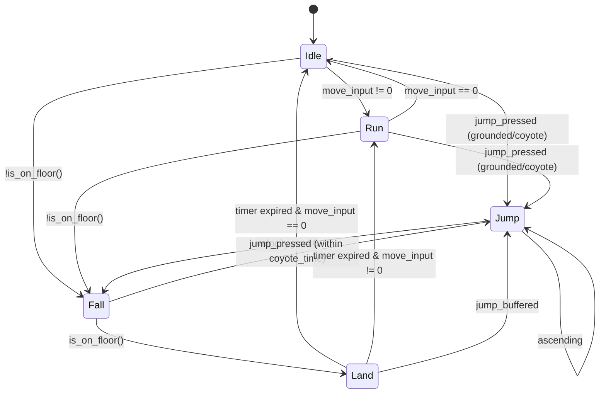

# Phase 2 Implementation Plan — Player Controller & Movement Foundation

**Project:** Echoes of the Celestial Staff  
**Engine:** Godot 4.7.2 Stable (GL Compatibility)  
**Phase:** Phase 2 (Player Controller)  
**Status:** Planning / Pending Approval  

---

## 1. Objective & Scope

Implement a responsive, precise, and fluid 2D player movement foundation for protagonist **Yuan** in Godot 4.7.2. The controller will embody action-platformer excellence—zero input lag, crisp stopping, coyote time, jump buffering, variable jump height, and clear facing direction—without introducing combat or attack mechanics.

### Systems To Build
1. **Player Movement Config Resource** (`res://scripts/player/player_movement_config.gd`, `res://data/characters/player_movement_config.tres`): Centralized data-driven physics parameters.
2. **State Machine Framework** (`res://scripts/systems/state.gd`, `res://scripts/systems/state_machine.gd`): Generic hierarchical state machine.
3. **Player Movement States** (`res://scripts/player/states/`):
   - `PlayerIdleState` (`Idle`)
   - `PlayerRunState` (`Run`)
   - `PlayerJumpState` (`Jump`)
   - `PlayerFallState` (`Fall`)
   - `PlayerLandState` (`Land`)
4. **Player Sub-Components**:
   - `PlayerMovement` (`res://scripts/player/player_movement.gd`): Pure movement, velocity, coyote time, jump buffering, and air control.
   - `PlayerAnimationController` (`res://scripts/player/player_animation_controller.gd`): Presentation decoupler matching movement states.
   - `PlayerRespawn` (`res://scripts/player/player_respawn.gd`): Spawn point anchoring, out-of-bounds detection, and state reset.
   - `PlayerDebugOverlay` (`res://scripts/player/player_debug_overlay.gd`): Real-time telemetry (State, Velocity, Timers, Grounded).
5. **Player Scene** (`res://scenes/player/player.tscn`): Assembled `CharacterBody2D` with CollisionShape2D, Camera2D, Visuals, and Components.
6. **Test Environment** (`res://scenes/world/test_player_room.tscn`): Metroidvania gym containing platforms, gaps, walls, and death pits.
7. **Automated Test Suite** (`res://tests/test_player_controller.gd`, `res://tests/test_player_runner.tscn`): Headless assertion tests.
8. **Manual Verification Checklist** (`res://docs/PLAYER_MOVEMENT_TEST_CHECKLIST.md`): Step-by-step validation criteria.

---

## 2. Player Scene Architecture (`scenes/player/player.tscn`)

```
Player (CharacterBody2D) [scripts/player/player_controller.gd]
├── CollisionShape2D (CapsuleShape2D: radius 10px, height 48px)
├── Visuals (Node2D)
│   ├── BodyRect (ColorRect: 20x48px, stylized jade/teal #16A085)
│   ├── HeadIndicator (ColorRect: 16x14px, dark #2C3E50)
│   └── FacingIndicator (Polygon2D: directional eye/sash pointing right/left)
├── Camera2D (Position smoothing enabled, 0.12s look-ahead, drag margins)
├── Components (Node)
│   ├── PlayerMovement [scripts/player/player_movement.gd]
│   ├── PlayerAnimationController [scripts/player/player_animation_controller.gd]
│   └── PlayerRespawn [scripts/player/player_respawn.gd]
├── StateMachine (Node) [scripts/systems/state_machine.gd]
│   ├── Idle (Node) [scripts/player/states/player_idle_state.gd]
│   ├── Run (Node) [scripts/player/states/player_run_state.gd]
│   ├── Jump (Node) [scripts/player/states/player_jump_state.gd]
│   ├── Fall (Node) [scripts/player/states/player_fall_state.gd]
│   └── Land (Node) [scripts/player/states/player_land_state.gd]
└── DebugOverlay (CanvasLayer) [scripts/player/player_debug_overlay.gd]
    └── PanelContainer / Label
```

---

## 3. Data-Driven Movement Configuration (`PlayerMovementConfig`)

Stored in `res://data/characters/player_movement_config.tres`:

| Parameter | Recommended Value | Rationale |
| :--- | :--- | :--- |
| `max_speed` | `260.0 px/s` | Agile, responsive walking/running speed. |
| `acceleration` | `1800.0 px/s²` | Reaches top speed in ~0.14s (immediate responsive feel). |
| `deceleration` | `2000.0 px/s²` | Instant stop without sliding on ground. |
| `air_acceleration` | `1300.0 px/s²` | Agile airborne micro-adjustments. |
| `air_deceleration` | `800.0 px/s²` | Maintains directional momentum in air. |
| `jump_velocity` | `-420.0 px/s` | Clear ~3.5 tile jump apex height. |
| `gravity` | `1100.0 px/s²` | Crisp downward pull preventing floatiness. |
| `fall_gravity_multiplier` | `1.4` | Falling accelerates faster than rising for game feel. |
| `low_jump_gravity_multiplier` | `2.2` | Releasing jump early cuts jump height cleanly. |
| `max_fall_speed` | `650.0 px/s` | Predictable terminal velocity. |
| `coyote_time` | `0.12 s` (7 frames) | Grace window after stepping off ledges. |
| `jump_buffer_time` | `0.12 s` (7 frames) | Pre-landing jump command queuing. |

---

## 4. State Machine Transition Diagram



---

## 5. Input Flow & GameManager Integration

1. `PlayerController` queries `InputManager.get_movement_axis()` and `InputManager.is_action_just_pressed(&"jump")`.
2. Movement processing strictly respects `GameManager.is_playing()`.
3. When `GameManager` enters `PAUSED`, `CUTSCENE`, or `LOADING`, player physics and velocity decay/freeze cleanly without dropping inputs or throwing null references.

---

## 6. Direction & Facing API

The player maintains an explicit facing state:
- `facing_direction: int = 1` (1 = Right, -1 = Left).
- `get_facing_direction() -> int`
- `is_facing_left() -> bool`
- `is_facing_right() -> bool`
- When moving right (`axis > 0`), facing updates to `1`; when moving left (`axis < 0`), facing updates to `-1`. Zero axis preserves existing facing.
- Visual elements scale `scale.x = facing_direction` cleanly while keeping collision shapes and camera offsets unrotated.

---

## 7. Camera Architecture

- Camera2D attached as child of Player.
- `position_smoothing_enabled = true`, `position_smoothing_speed = 8.0`.
- Look-ahead offset: shifts slightly in the direction of player movement (`offset.x = facing * 40.0`).
- Configurable limits prepared for future `Room2D` bounding.

---

## 8. Respawn Architecture

- `PlayerRespawn` tracks `spawn_position: Vector2`.
- `fall_death_y: float = 1200.0`. If player Y exceeds boundary:
  1. Zeros velocity.
  2. Teleports player back to `spawn_position`.
  3. Forces state machine into `Idle`.
  4. Emits `EventBus.player_died` or local respawn notification.

---

## 9. Testing & Validation Strategy

1. **Automated Headless Test Suite** (`tests/test_player_runner.tscn`):
   - Validates player instantiation and node tree.
   - Validates resource loading.
   - Validates horizontal acceleration math and speed clamping.
   - Validates jump impulse and gravity multipliers.
   - Validates coyote timer decrement and jump buffer expiration.
   - Validates facing direction API.
   - Validates out-of-bounds respawn and velocity reset.
   - Validates pause state suppression.
2. **Interactive Test Gym** (`scenes/world/test_player_room.tscn`):
   - Floor, variable height platforms (short hop vs full jump), 2-tile gap, 4-tile gap, high ledges, and pit hazard.
   - Validates real-time game feel and camera tracking.
3. **Static Analysis**:
   - Zero parser errors and zero warnings via `Godot --headless --check-only`.
