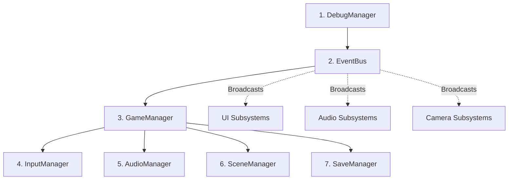

# Echoes of the Celestial Staff — Technical Architecture Specification

**Document Version:** 1.0.0  
**Phase:** Phase 0 (Architecture & Design)  
**Target Engine:** Godot 4.7.2 Stable  
**Renderer:** GL Compatibility (`gl_compatibility`)  
**Language:** Typed GDScript  

---

## 1. Architectural Philosophy

### 1.1 Core Principles
1. **Composition Over Deep Inheritance:** Actors (Player, Enemies, Bosses) are thin coordinator nodes (`CharacterBody2D`) composed of specialized, self-contained components (`HealthComponent`, `HitboxComponent`, `StaggerComponent`).
2. **Data-Driven Design:** All gameplay values—attack frames, damage numbers, poise thresholds, stance modifiers—reside in custom Godot `Resource` definitions (`.tres`), never hardcoded in scripts.
3. **Decoupled Communication:**
   - **Calls Down:** Parents instruct children directly via method calls (`health_component.apply_damage(amount)`).
   - **Signals Up:** Children notify parents of state changes via signals (`health_depleted.connect(_on_health_depleted)`).
   - **Cross-Domain Events:** Disparate systems communicate strictly through a centralized `EventBus` singleton.
4. **Separation of Concerns:** Gameplay logic (physics, damage, state transitions) operates independently of visual and auditory presentation (sprites, animation players, particle emitters, audio players).

---

## 2. Global Autoloads (Singletons)

All singletons are registered in `project.godot` under `[autoload]` in strict dependency order. They remain persistent across scene reloads.



### 2.1 `DebugManager` (`res://scripts/core/debug_manager.gd`)
- **Order:** Autoload #1 (Zero dependencies; provides categorized logging for all subsequent singletons).
- **Responsibilities:**
  - Categorized console logging: `log_info()`, `log_warn()`, `log_error()`, `log_debug()`.
  - Compile-time debug mode toggle (`is_debug_enabled = OS.is_debug_build()`) to suppress console overhead in release builds.
  - Performance telemetry queries: `get_fps()`, `get_static_memory_mb()`, `get_draw_calls()`.

### 2.2 `EventBus` (`res://scripts/core/event_bus.gd`)
- **Order:** Autoload #2.
- **Responsibilities:**
  - High-traffic, zero-coupling event broker.
  - Declares all global signals across combat, world, player, progression, and UI domains.
  - Implemented signals:
    - *Game Lifecycle:* `game_state_changed`, `game_paused`, `game_resumed`.
    - *Player Domain:* `player_spawned`, `player_died`, `player_health_changed`, `player_stamina_changed`, `player_spirit_changed`, `player_stance_changed`.
    - *Combat Domain:* `damage_dealt`, `damage_received`, `poise_broken`, `hitstop_requested`, `screen_shake_requested`.
    - *Enemy & Boss Domain:* `enemy_died`, `boss_started`, `boss_phase_changed`, `boss_defeated`.
    - *World & Progression:* `scene_loaded`, `scene_unloaded`, `checkpoint_activated`, `ability_unlocked`.

### 2.3 `GameManager` (`res://scripts/core/game_manager.gd`)
- **Order:** Autoload #3.
- **Responsibilities:**
  - Coordinates global game state enum: `BOOT`, `MENU`, `PLAYING`, `PAUSED`, `CUTSCENE`, `LOADING`, `GAME_OVER`.
  - Pause state coordination (`set_paused()`, `toggle_pause()`).
  - Engine timescale management (`set_time_scale()`, `reset_time_scale()`) for hitstop and cinematic slowdowns.
  - Strictly lightweight; contains zero gameplay or combat logic.

### 2.4 `InputManager` (`res://scripts/core/input_manager.gd`)
- **Order:** Autoload #4.
- **Responsibilities:**
  - Centralizes 15 standard action names: `move_left`, `move_right`, `jump`, `light_attack`, `heavy_attack`, `dodge`, `parry`, `ability_1`, `ability_2`, `ability_3`, `ability_4`, `stance_switch`, `interact`, `map`, `pause`.
  - Typed input queries: `is_action_just_pressed()`, `is_action_pressed()`, `is_action_just_released()`, `get_movement_axis()`.
  - Global pause intercept via unhandled input.
  - Input suppression toggle (`set_gameplay_input_enabled()`) for cutscenes/loading.
  - Dynamic fallback action registration in `InputMap` ensuring headless test and standalone stability.

### 2.5 `AudioManager` (`res://scripts/core/audio_manager.gd`)
- **Order:** Autoload #5.
- **Responsibilities:**
  - Manages audio routing across 6 dedicated buses: `Master`, `Music`, `SFX`, `Ambience`, `UI`, `Voice`.
  - Dedicated players for music, ambience, and UI sounds.
  - SFX pooling (8 pre-allocated `AudioStreamPlayer` instances) to eliminate runtime allocation hitches.
  - Methods: `play_music()`, `stop_music()`, `play_sfx()`, `play_ui_sound()`, `play_ambience()`, `set_bus_volume_db()`.
  - Safe error handling: gracefully logs warnings on null/missing audio streams without crashing.

### 2.6 `SceneManager` (`res://scripts/core/scene_manager.gd`)
- **Order:** Autoload #6.
- **Responsibilities:**
  - Centralizes scene switching: `change_scene_to_file()`, `change_scene_to_packed()`, `reload_current_scene()`.
  - Tracks `current_scene_path` and guards against concurrent transitions via `is_transitioning`.
  - Emits `scene_unloaded` and `scene_loaded` lifecycle events through `EventBus`.

### 2.7 `SaveManager` (`res://scripts/core/save_manager.gd`)
- **Order:** Autoload #7.
- **Responsibilities:**
  - Slot-based JSON persistence (`user://save_slot_%d.json`).
  - Schema versioning: `CURRENT_SAVE_VERSION = 1`.
  - Core schema: `save_version: int`, `timestamp: String`.
  - Robust validation and corruption fallback: gracefully returns empty dictionary on corrupted JSON or invalid structure without crashes.

---

### 2.8 Bootstrap & Entry Lifecycle (`res://scenes/core/bootstrap.tscn`)
- Configured as engine `run/main_scene` in `project.godot`.
- Boot sequence:
  1. Engine initializes Autoload singletons 1 through 7.
  2. `Bootstrap` verifies presence and readiness of all 7 singletons.
  3. `Bootstrap` notifies `GameManager` (`BOOT -> MENU`).
  4. `Bootstrap` delegates to `SceneManager` to transition cleanly to the initial menu or test scene (`scenes/core/test_scene.tscn`).

## 3. Entity & Component Architecture

### 3.1 Base Actor Blueprint & Player Architecture (`scenes/player/player.tscn`)
Actors never implement monolithic scripts. The Player is an orchestration node (`PlayerController`, `CharacterBody2D`) composed of specialized locomotion components, combat components, state machine, and presentation controllers:

```
Player (CharacterBody2D) [scripts/player/player_controller.gd]
├── CollisionShape2D (CapsuleShape2D: radius 9, height 46)
├── Visuals (Node2D)
│   ├── Body (ColorRect: 18x46, jade #16A085)
│   ├── Head (ColorRect: 14x14, dark #2C3E50)
│   ├── Sash (ColorRect: 16x6, celestial crimson #E74C3C)
│   ├── Eye (ColorRect: 3x3, celestial gold #F1C40F)
│   └── Staff (ColorRect: celestial bronze/gold)
├── Camera2D (Position smoothing enabled, look-ahead lead)
├── Components (Node)
│   ├── PlayerMovement [scripts/player/player_movement.gd]
│   ├── PlayerAnimationController [scripts/player/player_animation_controller.gd]
│   ├── PlayerRespawn [scripts/player/player_respawn.gd]
│   ├── CombatController [scripts/player/combat_controller.gd]
│   ├── DefenseController [scripts/player/defense_controller.gd]
│   ├── StanceController [scripts/player/stance_controller.gd]
│   ├── HealthComponent [scripts/combat/health_component.gd]
│   └── PoiseComponent [scripts/combat/poise_component.gd]
├── Combat (Node2D)
│   ├── PlayerHitbox (Area2D, Layer 4, Mask 7) [scripts/combat/hitbox.gd]
│   └── PlayerHurtbox (Area2D, Layer 6, Mask 0) [scripts/combat/hurtbox.gd]
├── StateMachine (Node) [scripts/systems/state_machine.gd]
│   ├── Idle (Node) [scripts/player/states/player_idle_state.gd]
│   ├── Run (Node) [scripts/player/states/player_run_state.gd]
│   ├── Jump (Node) [scripts/player/states/player_jump_state.gd]
│   ├── Fall (Node) [scripts/player/states/player_fall_state.gd]
│   ├── Land (Node) [scripts/player/states/player_land_state.gd]
│   ├── Attack (Node) [scripts/player/states/player_attack_state.gd]
│   ├── HeavyAttack (Node) [scripts/player/states/player_heavy_attack_state.gd]
│   ├── Dodge (Node) [scripts/player/states/player_dodge_state.gd]
│   ├── Parry (Node) [scripts/player/states/player_parry_state.gd]
│   └── AirAttack (Node) [scripts/player/states/player_air_attack_state.gd]
└── DebugOverlay (CanvasLayer) [scripts/player/player_debug_overlay.gd]
    └── PanelContainer / DebugLabel (Toggleable via F3)
```

#### Player Sub-Component Responsibilities:
1. **`PlayerMovement` (`scripts/player/player_movement.gd`):**
   - Driven by `PlayerMovementConfig` (`data/characters/player_movement_config.tres`).
   - Handles horizontal acceleration, deceleration, and independent air control rates.
   - Calculates gravity curves: rising gravity, falling gravity (`fall_gravity_multiplier = 1.4`), and variable jump cut (`low_jump_gravity_multiplier = 2.2`).
   - Implements coyote time (0.12s) and jump buffering (0.12s).
2. **`PlayerAnimationController` (`scripts/player/player_animation_controller.gd`):**
   - Decouples visual presentation from physics; applies squash/stretch feedback to placeholder visuals preserving facing scale.
   - Exposes combat & defense hooks: `play_attack_animation(id)`, `play_dodge_animation()`, `play_perfect_dodge_feedback()`, `play_parry_animation()`, `play_perfect_parry_feedback()`, `play_air_attack_animation()`, `play_charge_animation()`, `play_hit_reaction()`, `play_stagger()`.
3. **`PlayerRespawn` (`scripts/player/player_respawn.gd`):**
   - Tracks spawn position; resets velocity, position, and state upon falling below `fall_death_y = 1200.0`.
4. **`CombatController` (`scripts/player/combat_controller.gd`):**
   - Coordinates attack strings, combo window timing, input buffering (350ms window), aerial strikes, hold-to-charge scaling, recovery cancellation, and hitbox activation/deactivation during phases.
5. **`DefenseController` (`scripts/player/defense_controller.gd`):**
   - Coordinates ground dodge (0.35s duration, 0.033s-0.200s I-frames, 0.033s-0.100s perfect window), ground parry (0.033s startup, 0.033s-0.253s active, 0.033s-0.116s perfect window), poise break on perfect parry, attacker strike interruption, and hit interception prior to damage resolution.
6. **`PlayerController` (`scripts/player/player_controller.gd`):**
   - Central facing API (`facing_direction`: +1 for Right, -1 for Left; `get_facing_direction()`, `is_facing_left()`, `is_facing_right()`).
   - Locks facing mid-swing to prevent hitbox jitter.
   - Camera look-ahead interpolation.
   - Respects `GameManager.is_playing()` for pause and cutscene state suspension.

### 3.2 Core Component Specifications

#### `HealthComponent` (`scripts/combat/health_component.gd`)
- **Properties:** `max_health: float`, `current_health: float`, `is_invulnerable: bool`.
- **Functions:** `take_damage(amount: float) -> void`, `heal(amount: float) -> void`, `set_invulnerable(invulnerable: bool) -> void`, `reset() -> void`.
- **Signals:** `health_changed(current, max)`, `damaged(amount)`, `healed(amount)`, `died`.

#### `PoiseComponent` (`scripts/combat/poise_component.gd`)
- **Properties:** `max_poise: float`, `current_poise: float`, `stagger_duration: float`, `poise_regen_delay: float`, `poise_regen_rate: float`, `is_staggered: bool`.
- **Functions:** `take_poise_damage(amount: float) -> void`, `trigger_stagger() -> void`, `end_stagger() -> void`, `reset() -> void`.
- **Signals:** `poise_changed(current, max)`, `poise_broken`, `stagger_started(duration)`, `stagger_ended`.

#### `Hitbox` (`scripts/combat/hitbox.gd`, `Area2D`)
- **Collision Layer:** Configured to `PlayerHitbox` (Layer 4, bitmask 8) or `EnemyHitbox` (Layer 5, bitmask 16).
- **Collision Mask:** Layer 7 (`EnemyHurtbox`, bitmask 64) or Layer 6 (`PlayerHurtbox`, bitmask 32).
- **Responsibilities:** Monitors intersections with `Hurtbox`, prevents duplicate damage ticks per swing, and constructs `DamageInfo` payload.

#### `Hurtbox` (`scripts/combat/hurtbox.gd`, `Area2D`)
- **Collision Layer:** Configured to `PlayerHurtbox` (Layer 6, bitmask 32) or `EnemyHurtbox` (Layer 7, bitmask 64).
- **Collision Mask:** `0` (passive receiver).
- **Responsibilities:** Receives `DamageInfo`, delegates damage and poise reduction to sibling `HealthComponent` and `PoiseComponent`, and imparts knockback impulse.

---

## 4. Combat Systems Architecture

### 4.1 Data-Driven Attack Model (`AttackData.gd`)
Attacks are strictly modeled as Godot `Resource` assets (`res://data/attacks/`):
```gdscript
class_name AttackData
extends Resource

@export var attack_id: StringName = &""
@export var display_name: String = ""
@export var damage: float = 10.0
@export var poise_damage: float = 12.0
@export var knockback_force: Vector2 = Vector2(120.0, -30.0)
@export var startup_time: float = 0.067
@export var active_time: float = 0.050
@export var recovery_time: float = 0.133
@export var combo_window_start: float = 0.050
@export var combo_window_end: float = 0.220
@export var next_attack_id: StringName = &""
@export var forward_impulse: float = 30.0
@export var hitstop_duration: float = 0.050
@export var attack_priority: int = 1
```

### 4.2 Parry & Defense Pipeline
```mermaid
sequenceDiagram
    participant Attacker as Enemy Hitbox
    participant Defender as Player Hurtbox
    participant Parry as ParrySystem
    participant Health as HealthComponent
    participant EventBus as EventBus

    Attacker->>Defender: Overlaps with AttackData
    Defender->>Parry: Check Defending State
    alt Perfect Parry Window Active
        Parry-->>Defender: Intercepted (PARRY_SUCCESS)
        Parry->>EventBus: emit(screen_shake, hitstop, parry_sfx)
        Parry->>Attacker: inflict_recoil_and_poise_break()
    alt Dodge I-Frame Active
        Parry-->>Defender: Intercepted (DODGE_IMMUNE)
    else Unprotected
        Parry-->>Defender: Hit Confirmed
        Defender->>Health: take_damage(damage)
        Defender->>EventBus: emit(player_damaged)
    end
```

### 4.3 Combat Stance Architecture (`StanceData` & `StanceController`)
Combat stances adhere strictly to the principle of **"One Combat System, Three Combat Identities"** without duplicating controllers, state machines, or collision logic:
- **`StanceData` (`scripts/combat/stance_data.gd`):** Lightweight custom `Resource` defining:
  - `stance_type`: Enum (`SWIFT`, `MOUNTAIN`, `STORM`).
  - Movement multipliers: `movement_speed_multiplier`, `acceleration_multiplier`, `deceleration_multiplier`.
  - Attack multipliers: `attack_speed_multiplier`, `damage_multiplier`, `poise_damage_multiplier`.
  - Defense multipliers: `dodge_distance_multiplier`, `dodge_recovery_multiplier`, `parry_window_multiplier`.
  - Hitstop and visual tint properties.
- **Dynamic Multiplier Pipeline (Zero Base Mutation):**
  - Canonical attack resources (`data/attacks/*.tres`) remain strictly constant and immutable.
  - Multipliers are applied at evaluation time:
    - Locomotion speed: `velocity.x = move_toward(..., max_speed * stance.get_movement_speed_multiplier())`.
    - Attack phase timers: `phase_timer = base_duration / stance.get_attack_speed_multiplier()`.
    - Damage payloads: `payload.damage = base_damage * charge_multiplier * hitbox.stance_damage_multiplier`.
    - Poise damage: `payload.poise_damage = base_poise * poise_charge_multiplier * hitbox.stance_poise_multiplier`.
    - Dodge impulse: `dodge_velocity = base_impulse * stance.get_dodge_distance_multiplier()`.
    - Parry window: Maintained at `1.00x` baseline across all stances to safeguard precision timing and player muscle memory.
- **Stance Switching Gatekeeping:**
  - Stance switching is safely blocked during attack `STARTUP`, attack `ACTIVE`, heavy charge loops, mid-air attacks, and dodge I-frames.
  - Stance switching is permitted during `IDLE`, `RUN`, `FALL`, and attack `RECOVERY` frames (enabling stance-cancel combo routing).
  - Transition state persistence: Player health, poise, world position, and linear velocity are fully preserved across stance switches.

### 4.4 Spirit Ability Subsystem (`SpiritComponent`, `SpiritAbilityData`, `SpiritAbilityController`)
The Spirit Ability framework introduces active martial powers powered by combat-earned Spirit:
- **`SpiritComponent` (`scripts/player/spirit_component.gd`):**
  - Tracks player's Spirit meter (`current_spirit`, `max_spirit = 100.0`).
  - Strict transactional consumption (`consume_spirit(amount) -> bool`) ensuring abilities only fire if sufficient Spirit exists.
  - Clamped replenishment (`restore_spirit(amount)`) bounded by `[0.0, max_spirit]`.
  - Combat restoration hooks: Light attack hit (+4.0), Heavy attack hit (+8.0), Perfect parry (+10.0). Emits `player_spirit_changed(current, max)`.
- **`SpiritAbilityData` (`scripts/abilities/spirit_ability_data.gd`):**
  - Custom data-driven `Resource` defining:
    - `ability_id: String`, `ability_name: String`, `ability_type: AbilityType` (`PROJECTILE`, `AREA`, `MOBILITY`, `BUFF`).
    - Timing parameters: `startup_time: float`, `active_time: float`, `recovery_time: float`, `cooldown: float`.
    - Cost & combat parameters: `spirit_cost: float`, `damage: float`, `poise_damage: float`, `knockback_force: Vector2`, `hitstop_duration: float`, `screenshake_intensity: float`.
    - Mobility/spatial parameters: `burst_velocity: float`, `area_radius: float`, `can_use_airborne: bool`, `projectile_scene: PackedScene`.
- **`SpiritAbilityController` (`scripts/player/spirit_ability_controller.gd`):**
  - Manages equipped ability loadout (Array of 3 `SpiritAbilityData` slots).
  - Cooldown tracking per slot using countdown timers.
  - Phase lifecycle: `READY` -> `STARTUP` -> `ACTIVE` -> `RECOVERY` -> `COOLDOWN`.
  - Casting gatekeeping: Rejects activation during weapon attack `STARTUP`/`ACTIVE`, dodge invulnerability, active parry frames, or when insufficient Spirit or active cooldown.
  - Execution delegates:
    - `PROJECTILE` (e.g. Celestial Arc): Spawns `SpiritProjectile` on Layer 4 (`PlayerHitbox`) at cast point, applying direction-aware velocity, damage, and single-hit hurtbox tracking.
    - `AREA` (e.g. Heavenly Pulse): Performs zero-allocation shape query / distance-based hurtbox scan within `area_radius` (64px) on Layer 7 (`EnemyHurtbox`), delivering heavy damage (24.0) and high poise damage (35.0).
    - `MOBILITY` (e.g. Cloud Step): Injects horizontal burst velocity (550.0 px/s) along facing vector without granting unconditional invulnerability or corrupting world collision masks.
- **`PlayerSpiritAbilityState` (`scripts/player/states/player_spirit_ability_state.gd`):**
  - Dedicated State Machine state node. Decoupled from weapon attacks.
  - Handles ground decelerations or aerial gravity during casting.
  - Permits early recovery cancellation into Dodge or Parry.
- **HUD & Telemetry:**
  - `SpiritHUD` (`scripts/ui/spirit_hud.gd`): Real-time Spirit gauge, slot labels, and radial/fill cooldown overlays.
  - `PlayerDebugOverlay`: Real-time telemetry displaying current Spirit and cooldown timers.

---

## 5. World & Room Architecture

### 5.1 Room Chunking (`Room2D`)
- Metroidvania areas are partitioned into individual `Room2D` scenes.
- Each `Room2D` contains:
  - `TileMapLayer` nodes (Background, Ground/Walls, Foreground Hazards).
  - `Enemies` container node.
  - `Collectibles` container node.
  - `Doors` (`Area2D` triggers linked to target room and target entrance ID).
  - `CameraBounds` (`ReferenceRect` defining the virtual camera clamping area).

### 5.2 Room State Persistence
- When an enemy or one-time collectible is picked up, it registers its unique GUID with `WorldManager`.
- Upon re-entering a room, already collected items or triggered switches remain in their resolved state.

---

## 6. Collision Layer Matrix

To prevent physics overhead and bugs, collision layers are explicitly partitioned:

| Layer ID | Name | Description |
| :--- | :--- | :--- |
| **Layer 1** | `WorldGeometry` | Solid terrain, platforms, one-way floors. |
| **Layer 2** | `Player` | Player CharacterBody2D physics collider. |
| **Layer 3** | `Enemies` | Enemy CharacterBody2D physics collider. |
| **Layer 4** | `PlayerHitbox` | Attacks initiated by the player. |
| **Layer 5** | `EnemyHitbox` | Attacks initiated by enemies/bosses. |
| **Layer 6** | `PlayerHurtbox` | Hit-detection zone for the player. |
| **Layer 7** | `EnemyHurtbox` | Hit-detection zone for enemies. |
| **Layer 8** | `Triggers` | Room transitions, checkpoints, environmental interactables. |

---

## 7. Performance & Memory Management

1. **Object Pooling:** Projectiles, impact sparks, and damage numbers use lightweight node pools (`scripts/systems/node_pool.gd`) to avoid dynamic instantiation spikes.
2. **Signal Disconnection:** Nodes disconnecting from the scene tree ensure all lambdas and signals are safely unbound to avoid orphan node leaks.
3. **Strict Resource Preloading:** Boss assets, heavy particle scenes, and sound libraries are preloaded asynchronously during scene transitions.
