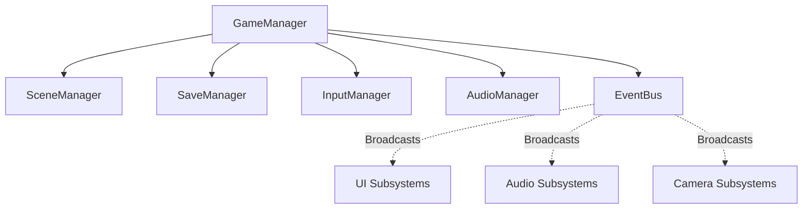

# Echoes of the Celestial Staff — Technical Architecture Specification

**Document Version:** 1.0.0  
**Phase:** Phase 0 (Architecture & Design)  
**Target Engine:** Godot 4.7.2 Stable  
**Renderer:** GL Compatibility (`gl_compatibility`)  
**Language:** Typed GDScript  

---

## 1. Architectural Philosophy

### 1.1 Core Principles
1. **Composition Over Deep Inheritance:** Actors (Player, Enemies, Bosses) are thin coordinator nodes (`CharacterBody2D`) composed of specialized, self-contained components (`HealthComponent`, `HitboxComponent`, `StaggerComponent`).
2. **Data-Driven Design:** All gameplay values—attack frames, damage numbers, poise thresholds, stance modifiers—reside in custom Godot `Resource` definitions (`.tres`), never hardcoded in scripts.
3. **Decoupled Communication:**
   - **Calls Down:** Parents instruct children directly via method calls (`health_component.apply_damage(amount)`).
   - **Signals Up:** Children notify parents of state changes via signals (`health_depleted.connect(_on_health_depleted)`).
   - **Cross-Domain Events:** Disparate systems communicate strictly through a centralized `EventBus` singleton.
4. **Separation of Concerns:** Gameplay logic (physics, damage, state transitions) operates independently of visual and auditory presentation (sprites, animation players, particle emitters, audio players).

---

## 2. Global Autoloads (Singletons)

All singletons are registered in `project.godot` under `[autoload]`. They remain persistent across scene reloads.



### 2.1 `GameManager.gd` (`res://scripts/core/game_manager.gd`)
- **Responsibilities:**
  - Manages global game states: `TITLE_SCREEN`, `PLAYING`, `PAUSED`, `CUTSCENE`, `GAME_OVER`.
  - Coordinates game timescale for hitstop and cinematic slowdowns (`Engine.time_scale`).
  - Manages pause menu toggles and input state suppression.

### 2.2 `EventBus.gd` (`res://scripts/core/event_bus.gd`)
- **Responsibilities:**
  - High-traffic, zero-coupling event broker.
  - Declares all global signals across combat, world, player, progression, and UI domains.
  - Examples:
    ```gdscript
    signal player_health_changed(current: float, maximum: float)
    signal player_stamina_changed(current: float, maximum: float)
    signal player_spirit_changed(current: float, maximum: float)
    signal player_stance_changed(new_stance_id: StringName)
    signal enemy_damaged(enemy: Node2D, amount: float, is_crit: bool)
    signal enemy_died(enemy: Node2D, bounty_qi: int)
    signal boss_phase_changed(boss_name: String, phase_index: int)
    signal screen_shake_requested(trauma: float, duration: float)
    signal hitstop_requested(duration_frames: int)
    signal room_transition_requested(target_scene_path: String, target_spawn_id: String)
    ```

### 2.3 `SceneManager.gd` (`res://scripts/core/scene_manager.gd`)
- **Responsibilities:**
  - Handles asynchronous room loading (`ResourceLoader.load_threaded_request`).
  - Orchestrates screen fade-out/fade-in transitions.
  - Spawns the player at designated `SpawnPoint2D` markers upon room entry.

### 2.4 `InputManager.gd` (`res://scripts/core/input_manager.gd`)
- **Responsibilities:**
  - Abstraction layer over Godot's `Input` event system.
  - Implements an **Input Buffer Queue** (stores buffered attack/dodge inputs for 8 frames).
  - Handles gamepad and keyboard deadzones, remapping profiles, and input device detection.

### 2.5 `AudioManager.gd` (`res://scripts/core/audio_manager.gd`)
- **Responsibilities:**
  - Manages global audio buses: `Master`, `Music`, `Ambience`, `SFX`, `PlayerSFX`, `EnemySFX`, `UI`.
  - Audio stream pooling for high-frequency SFX (preventing allocation hitches).
  - Crossfades dynamic combat and ambient music layers.
  - Applies dynamic low-pass bus filters during pause and hitstop events.

### 2.6 `SaveManager.gd` (`res://scripts/core/save_manager.gd`)
- **Responsibilities:**
  - Encapsulates player progression serialization (`user://save_slot_1.json`).
  - Manages save slots, autosaves at Spirit Shrines, and safe backup writing.
  - Serializes: unlocked abilities, world flags (opened doors, defeated bosses), collected relics, player stats.

---

## 3. Entity & Component Architecture

### 3.1 Base Actor Blueprint (`CharacterBody2D`)
Actors never implement monolithic scripts. Instead, an actor is an orchestration node that links components.

```
Player (CharacterBody2D) [scripts/player/player_controller.gd]
├── CollisionShape2D
├── Visuals (Node2D)
│   ├── AnimatedSprite2D / Sprite2D
│   ├── AnimationPlayer
│   └── VisualTrail (Line2D / Ghost)
├── Components (Node)
│   ├── HealthComponent [scripts/combat/health_component.gd]
│   ├── StaminaComponent [scripts/combat/stamina_component.gd]
│   ├── SpiritComponent [scripts/combat/spirit_component.gd]
│   ├── StaggerComponent [scripts/combat/stagger_component.gd]
│   ├── StanceManager [scripts/player/stance_manager.gd]
│   ├── AbilityManager [scripts/player/ability_manager.gd]
│   └── HurtboxComponent [scripts/combat/hurtbox_component.gd]
├── Hitboxes (Node2D)
│   └── HitboxComponent [scripts/combat/hitbox_component.gd]
│       └── CollisionShape2D
├── StateMachine [scripts/systems/state_machine.gd]
│   ├── IdleState
│   ├── RunState
│   ├── JumpState
│   ├── AttackState
│   ├── DodgeState
│   └── StaggerState
└── Raycasts (Node2D)
    ├── FloorRays
    └── LedgeRays
```

### 3.2 Core Component Specifications

#### `HealthComponent`
- **Properties:** `max_health: float`, `current_health: float`, `invulnerable: bool`.
- **Functions:** `take_damage(amount: float) -> void`, `heal(amount: float) -> void`, `set_invulnerable(duration: float) -> void`.
- **Signals:** `health_changed(current, max)`, `damaged(amount)`, `healed(amount)`, `died`.

#### `StaminaComponent`
- **Properties:** `max_stamina: float`, `current_stamina: float`, `regen_rate: float`, `regen_delay: float`.
- **Functions:** `consume(amount: float) -> bool`, `has_stamina(amount: float) -> bool`.
- **Signals:** `stamina_changed(current, max)`, `exhausted`.

#### `SpiritComponent`
- **Properties:** `max_spirit: float`, `current_spirit: float`.
- **Functions:** `gain_spirit(amount: float) -> void`, `consume_spirit(amount: float) -> bool`.
- **Signals:** `spirit_changed(current, max)`, `spirit_full`.

#### `HitboxComponent` (`Area2D`)
- **Collision Layer:** Configured to `PlayerHitbox` (Layer 4) or `EnemyHitbox` (Layer 5).
- **Properties:** `attack_data: AttackData` (Godot Resource).
- **Responsibilities:** Monitors intersections with `HurtboxComponent` and passes `AttackData` payload.

#### `HurtboxComponent` (`Area2D`)
- **Collision Layer:** Configured to `PlayerHurtbox` (Layer 6) or `EnemyHurtbox` (Layer 7).
- **Signals:** `hit_received(attack_data: AttackData)`.
- **Responsibilities:** Validates if parent is dodging or invulnerable; if not, dispatches damage and poise reduction to `HealthComponent` and `StaggerComponent`.

#### `StaggerComponent`
- **Properties:** `max_poise: float`, `current_poise: float`, `poise_regen_delay: float`, `is_staggered: bool`.
- **Responsibilities:** Accumulates poise damage. When poise hits zero, triggers guard-break / stagger state and emits `stagger_triggered(duration: float)`.

---

## 4. Combat Systems Architecture

### 4.1 Data-Driven Attack Model (`AttackData.gd`)
Attacks are strictly modeled as Godot `Resource` assets (`res://data/attacks/`):
```gdscript
class_name AttackData
extends Resource

@export var attack_name: StringName = &""
@export var damage: float = 10.0
@export var poise_damage: float = 15.0
@export var stamina_cost: float = 12.0
@export var spirit_gain: float = 8.0
@export var knockback_force: Vector2 = Vector2(150.0, -50.0)
@export var hitstop_frames: int = 4
@export var screen_trauma: float = 0.15
@export var hit_sound: AudioStream
@export var hit_vfx_scene: PackedScene
@export var is_unblockable: bool = false
```

### 4.2 Parry & Defense Pipeline
```mermaid
sequenceDiagram
    participant Attacker as Enemy Hitbox
    participant Defender as Player Hurtbox
    participant Parry as ParrySystem
    participant Health as HealthComponent
    participant EventBus as EventBus

    Attacker->>Defender: Overlaps with AttackData
    Defender->>Parry: Check Defending State
    alt Perfect Parry Window Active
        Parry-->>Defender: Intercepted (PARRY_SUCCESS)
        Parry->>EventBus: emit(screen_shake, hitstop, parry_sfx)
        Parry->>Attacker: inflict_recoil_and_poise_break()
    alt Dodge I-Frame Active
        Parry-->>Defender: Intercepted (DODGE_IMMUNE)
    else Unprotected
        Parry-->>Defender: Hit Confirmed
        Defender->>Health: take_damage(damage)
        Defender->>EventBus: emit(player_damaged)
    end
```

---

## 5. World & Room Architecture

### 5.1 Room Chunking (`Room2D`)
- Metroidvania areas are partitioned into individual `Room2D` scenes.
- Each `Room2D` contains:
  - `TileMapLayer` nodes (Background, Ground/Walls, Foreground Hazards).
  - `Enemies` container node.
  - `Collectibles` container node.
  - `Doors` (`Area2D` triggers linked to target room and target entrance ID).
  - `CameraBounds` (`ReferenceRect` defining the virtual camera clamping area).

### 5.2 Room State Persistence
- When an enemy or one-time collectible is picked up, it registers its unique GUID with `WorldManager`.
- Upon re-entering a room, already collected items or triggered switches remain in their resolved state.

---

## 6. Collision Layer Matrix

To prevent physics overhead and bugs, collision layers are explicitly partitioned:

| Layer ID | Name | Description |
| :--- | :--- | :--- |
| **Layer 1** | `WorldGeometry` | Solid terrain, platforms, one-way floors. |
| **Layer 2** | `Player` | Player CharacterBody2D physics collider. |
| **Layer 3** | `Enemies` | Enemy CharacterBody2D physics collider. |
| **Layer 4** | `PlayerHitbox` | Attacks initiated by the player. |
| **Layer 5** | `EnemyHitbox` | Attacks initiated by enemies/bosses. |
| **Layer 6** | `PlayerHurtbox` | Hit-detection zone for the player. |
| **Layer 7** | `EnemyHurtbox` | Hit-detection zone for enemies. |
| **Layer 8** | `Triggers` | Room transitions, checkpoints, environmental interactables. |

---

## 7. Performance & Memory Management

1. **Object Pooling:** Projectiles, impact sparks, and damage numbers use lightweight node pools (`scripts/systems/node_pool.gd`) to avoid dynamic instantiation spikes.
2. **Signal Disconnection:** Nodes disconnecting from the scene tree ensure all lambdas and signals are safely unbound to avoid orphan node leaks.
3. **Strict Resource Preloading:** Boss assets, heavy particle scenes, and sound libraries are preloaded asynchronously during scene transitions.
