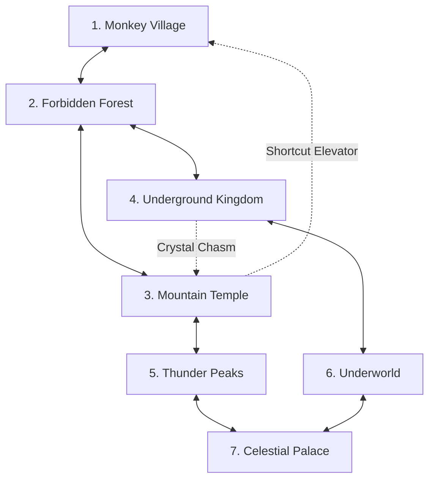

# Echoes of the Celestial Staff — World Design & Level Architecture

**Document Version:** 1.0.0  
**Phase:** Phase 0 (Architecture & Design)  
**Target Engine:** Godot 4.7.2 Stable  
**Structure:** Non-Linear Interconnected 2D Metroidvania  

---

## 1. World Topology & Biome Overview

The world of *Echoes of the Celestial Staff* is an interconnected continent built around the sacred pillar of Mount Kunlun, descending into forgotten depths and ascending toward the cosmic heavens.



---

## 2. Detailed Biome Specifications

### 2.1 Biome 1: Monkey Village (The Cradle of Qi)
- **Visuals:** Sunlit bamboo groves, weathered wooden pagodas, quiet streams, fluttering paper lanterns.
- **Narrative Role:** Starting tutorial area and peaceful hub. Safe sanctuary where Yuan trains with the Elder.
- **Gameplay Focus:** Teaches fundamental locomotion (run, jump, slide), light attacks on training dummies, and first skirmishes with feral spirit beasts.
- **Key Discovery:** Retrieval of the **Spirit Staff** from the ancestral altar, awakening Swift Stance.

### 2.2 Biome 2: Forbidden Forest (The Overgrown Spires)
- **Visuals:** Towering ancient redwood canopy, bioluminescent moss, swirling green mist, moss-draped stone bridges.
- **Narrative Role:** The sacred grounds overrun by poisonous wildlife and aggressive plant-spirit fiends.
- **Gameplay Focus:** Vertical platforming, branch hopping, avoiding toxic ground pools. Teaches dodge timing against fast predatory stalkers.
- **Gating / Ability Reward:** Defeating the *Canopy Stalker* unlocks the **Celestial Vault** (Staff-assisted double jump/high vault).

### 2.3 Biome 3: Mountain Temple (The Stone Bastion)
- **Visuals:** Massive terraced monastic fortresses carved into granite cliffs, towering bell towers, smoldering braziers.
- **Narrative Role:** The stronghold of the corrupted Martial Monks who sealed the mountain leylines.
- **Gameplay Focus:** Heavy combat challenges. Shield-bearing sentinels, parry-testing spearmen, and crushing trap doors.
- **Gating / Ability Reward:** Defeating the *Granite Abbot* awakens the **Flame Staff** and unlocks **Mountain Stance** (shattering granite barriers and lighting fire braziers).

### 2.4 Biome 4: Underground Kingdom (The Hollow Forge)
- **Visuals:** Deep subterranean chasm, luminous amethyst clusters, ancient bronze gears, magma aqueducts.
- **Narrative Role:** The remnants of an ancient subterranean civilization that forged the cosmic conduits.
- **Gameplay Focus:** Environmental hazards, timed crushers, wall-sliding and wall-jumping through tight shafts.
- **Gating / Ability Reward:** Unlocks the **Astral Grip** (wall cling and wall climb ability).

### 2.5 Biome 5: Thunder Peaks (The Gale Spires)
- **Visuals:** Jagged mountain needles pierces by perpetual lightning storms, howling wind, dynamic rain, swaying suspension bridges.
- **Narrative Role:** The celestial conduit where cosmic storms focus onto the earth.
- **Gameplay Focus:** Wind-affected jumps, timing crossings during lightning strikes, high-speed combat.
- **Gating / Ability Reward:** Defeating the *Thunder Sovereign* awakens the **Thunder Staff** and unlocks **Storm Stance** and the **Magnetic Rail Glide**.

### 2.6 Biome 6: The Underworld (The Spectral Abyss)
- **Visuals:** Inverted gravity vistas, ghostly blue spirit flames, decaying black stone ruins, shattered celestial fragments floating in the void.
- **Narrative Role:** The cosmic graveyard where corrupted celestial essence accumulates.
- **Gameplay Focus:** High-stakes combat, phase-shifting platforms, ethereal enemies requiring parries to materialize.
- **Gating / Ability Reward:** Overcoming the *Shadow Reflection of Yuan* awakens **Celestial Awakening (Transformation)**.

### 2.7 Biome 7: Celestial Palace (The Cosmic Spire)
- **Visuals:** Opulent golden palaces resting on crystalline clouds, starlight bridges, shimmering cosmic nebulae in the backdrop.
- **Narrative Role:** The throne of cosmic balance where the fractured core of heaven rests.
- **Gameplay Focus:** Ultimate synthesis of all traversal and combat mechanics. Relentless multi-tier encounters, complex platforming gauntlets.
- **Climax:** Multi-phase confrontation with the *Celestial Arbiter*.

---

## 3. Ability Gating Matrix

| Gating Mechanism | Unlocking Ability / Weapon | Biomes Affected | Description of Interaction |
| :--- | :--- | :--- | :--- |
| **Fragile Bamboo / Vines** | Broken Staff (Basic Attack) | Monkey Village | Basic weapon slash clears pathway. |
| **High Elevated Ledges (3m+)** | Celestial Vault (Spirit Staff) | Forest, Temple | Vault off the staff to reach high vertical ledges. |
| **Granite Rubble / Heavy Seals** | Mountain Stance Slam (Flame Staff) | Temple, Underground | Overhead heavy slam shatters reinforced stone blocks. |
| **Unclimbable Sheer Walls** | Astral Grip (Climbing Claw) | Underground, Peaks | Enables vertical wall sliding and repeated wall kicking. |
| **Magnetic Zip-Rails** | Storm Stance / Thunder Staff | Peaks, Palace | Staff locks onto ionized rails for rapid horizontal/diagonal flight. |
| **Cosmic Spatial Rifts** | Celestial Transformation | All Biomes | Transcends physical reality to bypass dimensional barrier seals. |

---

## 4. Checkpoints & Save Shrines: Spirit Shrines

### 4.1 Shrine Functionality
- **Restoration:** Restores 100% of Yuan’s Health, Stamina, and Healing Flasks.
- **Enemy Reset:** Respawns all standard enemies in the biome. Bosses, minibosses, opened shortcut gates, and collected items remain permanent.
- **Skill Awakening:** Opens the constellation UI to spend harvested Celestial Qi on skill tree unlocks.
- **Fast Travel:** Major Shrines (1 per biome) form a teleportation leyline network. Minor Shrines serve only as local checkpoints and rest stops.

---

## 5. Room Design & Streaming Architecture

### 5.1 Room Standard Dimensions
- Standard single screen room: `1920 x 1080` (16:9 view).
- Multi-screen rooms: Multiples of 1920 horizontally (e.g., `3840 x 1080` for corridor) or multiples of 1080 vertically (`1920 x 2160` for vertical shafts).

### 5.2 Room Structure (`Room2D.tscn`)
```
Room_Forest_01 (Node2D) [Room2D]
├── WorldGeometry (StaticBody2D)
│   ├── CollisionPolygon2D / TileMapLayer (Solid ground & walls)
│   └── OneWayPlatforms (TileMapLayer)
├── BackgroundParallax (ParallaxBackground)
│   ├── FarLayer (0.2 scroll)
│   ├── MidLayer (0.5 scroll)
│   └── NearLayer (0.8 scroll)
├── Spawners (Node2D)
│   ├── EnemySpawner_A
│   └── EnemySpawner_B
├── Interactables (Node2D)
│   ├── SpiritShrine
│   └── ShortcutDoor
├── CameraBounds (ReferenceRect)
└── Exits (Node2D)
    ├── Exit_Left (Area2D -> Target: Room_Village_05, Spawn: Right)
    └── Exit_Right (Area2D -> Target: Room_Forest_02, Spawn: Left)
```

### 5.3 Room Transition Mechanics
- When player enters an `Exit Area2D`, `SceneManager` executes:
  1. Freeze player physics and input.
  2. Fade screen to black (0.2s duration).
  3. Swap active `Room2D` scene via threaded loader.
  4. Position player at the linked `SpawnPoint2D`.
  5. Clamp camera to new room's `CameraBounds`.
  6. Fade screen from black (0.2s duration) and restore player control.
